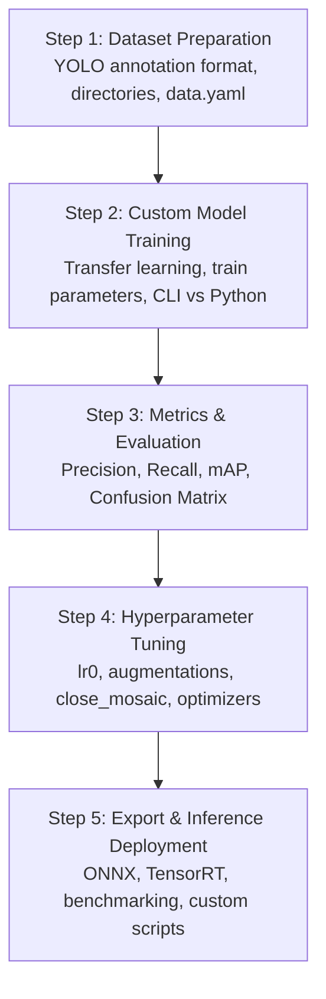

# Ultralytics YOLO Learning Path & Syllabus

This curriculum is designed to guide you from basic library usage to training custom models and deploying them in production. 

---

## 🗺️ Step-by-Step Learning Roadmap

---

## 📘 Detailed Syllabus Breakdown

### 🎯 Step 1: Dataset Preparation (The Foundation)
To train YOLO on your own objects, you must first prepare a custom dataset.
*   **Key Concepts to Learn:**
    *   **Annotation Format:** Text files with `class_id x_center y_center width height` normalized between `0` and `1`.
    *   **Folder Structure:** Splitting data into `train/` and `val/` directories, separating `images/` from `labels/`.
    *   **Configuration File (`data.yaml`):** Defining directories, class count (`nc`), and names of the labels.
*   **Where to Start:** 
    *   Open and read [YOLO_Training_Manual.ipynb](file:///home/luke/ai_training/ultralytics/learning_lab/notebooks/YOLO_Training_Manual.ipynb) for instructions on structuring datasets.

### 🎯 Step 2: Custom Model Training (Transfer Learning)
Instead of training a model from scratch, you will fine-tune a model initialized with pre-trained weights (e.g. `yolo26n.pt`), which speeds up training and improves accuracy.
*   **Key Concepts to Learn:**
    *   Configuring train arguments: `epochs`, `imgsz`, `batch`, `device`, `workers`.
    *   Monitoring live logs in the console.
    *   Understanding the difference between CPU and GPU (`device=0` or `device=cuda`) training.
*   **Where to Start:**
    *   Follow the execution guide inside [YOLO_Training_Manual.ipynb](file:///home/luke/ai_training/ultralytics/learning_lab/notebooks/YOLO_Training_Manual.ipynb) to launch your first training run.

### 🎯 Step 3: Performance Analysis & Evaluation Metrics
After training finishes, YOLO outputs metrics and charts under `runs/detect/train/`. You need to know how to interpret them to see if your model is ready.
*   **Key Concepts to Learn:**
    *   **mAP@0.5 vs mAP@0.5:0.95:** Understanding how strict bounding box overlapping (IoU) thresholds affect accuracy metrics.
    *   **Confusion Matrix:** Identifying which classes are misclassified or confused with background.
    *   **F1-Curve, Precision-Recall (PR) Curve:** Determining the best confidence threshold for inference.
    *   **Loss Curves:** Tracking `box_loss` (bounding box location), `cls_loss` (class classification accuracy), and `dfl_loss` (Distribution Focal Loss) to check for overfitting.
*   **Where to Start:**
    *   Open and study [YOLO_Metrics_Explained.ipynb](file:///home/luke/ai_training/ultralytics/learning_lab/notebooks/YOLO_Metrics_Explained.ipynb).

### 🎯 Step 4: Hyperparameter Tuning (Fine-tuning performance)
If the model's accuracy is too low or it overfits, you tune the learning configurations.
*   **Key Concepts to Learn:**
    *   Learning rates (`lr0`, `lrf`), learning rate schedulers (e.g. Cosine Annealing `cos_lr`).
    *   Augmentations: Understading `mosaic`, `mixup`, `scale`, `shear`, and `close_mosaic` (disabling mosaic augmentation in the final epochs to improve localization precision).
    *   Regularization: Weight decay and dropout.
*   **Where to Start:**
    *   Open and study [YOLO_Hyperparameters_Explained.ipynb](file:///home/luke/ai_training/ultralytics/learning_lab/notebooks/YOLO_Hyperparameters_Explained.ipynb).

### 🎯 Step 5: Exporting & Optimizing Inference
Deploying PyTorch weights (`.pt`) directly can be slow. You will convert the model to runtime engines optimized for specific hardware.
*   **Key Concepts to Learn:**
    *   **ONNX (Open Neural Network Exchange):** A standard format compatible with many backends.
    *   **TensorRT (`.engine`):** Optimized for NVIDIA GPUs.
    *   **Quantization:** Converting model layers to FP16 or INT8 precision for massive latency improvements.
    *   **Inference Scripts:** Writing custom Python scripts that use OpenCV and the `YOLO` API to parse live video frames, track detections, or run inference on server endpoints.
*   **Where to Start:**
    *   Refer back to the **Export** section of [tutorial.ipynb](file:///home/luke/ai_training/ultralytics/examples/tutorial.ipynb).
