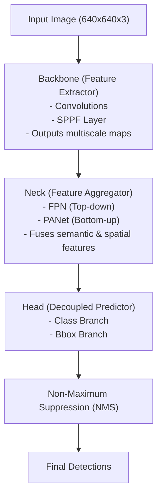

# 🧠 EX44: Object Detection Pipeline Architecture

A single-stage object detector (like YOLO) processes an entire image in a single pass. To achieve this, the network architecture is structured into three main sequential components: the **Backbone**, the **Neck**, and the **Head**.

---

## 1. Pipeline Flow Visualization

---

## 2. The Three Pipeline Stages

### A. The Backbone (Feature Extractor)
The backbone takes the raw input pixels and runs convolutions to extract feature maps of different scales. 
*   **Key Concept:** Early layers extract low-level features (edges, corners). Deeper layers extract high-level semantic features (whole shapes, classes).
*   **Important Layer (SPPF - Spatial Pyramid Pooling Fast):** Placed at the end of the backbone, SPPF pools features at different scales ($5\times5$, $9\times9$, $13\times13$) and concatenates them to capture objects of widely varying sizes without changing feature dimensions.

### B. The Neck (Feature Aggregator)
The neck merges feature maps from different depths of the backbone:
*   **FPN (Feature Pyramid Network):** Passes strong semantic features from deep layers down to shallow layers.
*   **PANet (Path Aggregation Network):** Passes spatial details from shallow layers back up to deep layers.
*   **Result:** This dual-pathway feature fusion ensures that both tiny objects (requiring high resolution) and large objects (requiring global context) are represented with accurate spatial coordinates and semantic class information.

### C. The Head (Predictor)
The head takes the fused features from the neck and predicts classes and bounding boxes.
*   **Decoupled Heads (YOLOv8/11):** Classic YOLO used a single head (coupled) to predict both classification and box regression. Modern YOLO decouples them into two separate branches. This avoids representation conflicts, as classification requires texture/color features, whereas coordinate regression requires precise spatial boundary features.

---
*Related Topics:*
*   [[EX43_NMS\|EX43: Non-Maximum Suppression]]
*   [[EX45_Anchor_Box\|EX45: Anchor Boxes vs. Anchor-Free]]
*   Return to main plan: [[YOLO_Learning_Plan]]
*   Progress log: [[learning_journal]]
