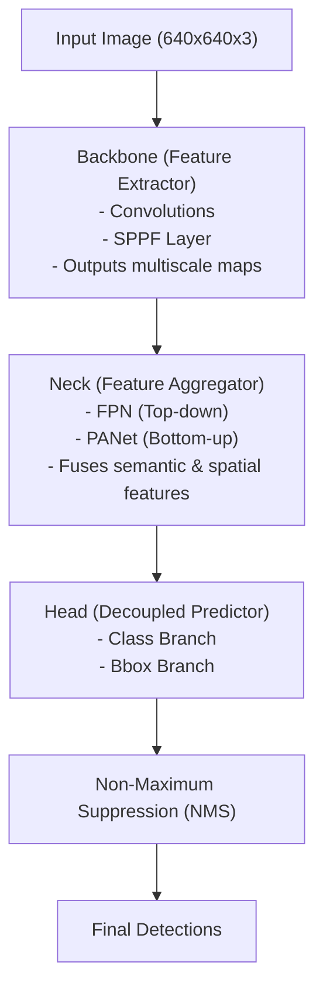

# 🧠 EX44: สถาปัตยกรรมขั้นตอนการประมวลผลสำหรับการตรวจจับวัตถุ (Object Detection Pipeline Architecture)

ตัวตรวจจับวัตถุแบบขั้นตอนเดียว (Single-stage object detector) เช่น YOLO จะประมวลผลรูปภาพทั้งหมดภายในขั้นตอนการป้อนข้อมูลรอบเดียว (single pass) เพื่อให้บรรลุเป้าหมายนี้ สถาปัตยกรรมโครงข่ายจึงถูกจัดโครงสร้างออกเป็น 3 ส่วนหลักที่เรียงลำดับกัน ได้แก่ **Backbone (กระดูกสันหลัง)**, **Neck (ส่วนคอ)**, และ **Head (ส่วนหัว)**

---

## 1. แผนภาพขั้นตอนการประมวลผล (Pipeline Flow Visualization)

---

## 2. ขั้นตอนการประมวลผลทั้งสามส่วน (The Three Pipeline Stages)

### A. Backbone (ส่วนดึงฟีเจอร์ - Feature Extractor)
Backbone จะรับพิกเซลข้อมูลดิบของภาพอินพุตเข้ามา จากนั้นจะทำการดำเนินการสังเลิฟ (convolutions) เพื่อดึงแผนที่ฟีเจอร์ (feature maps) ที่มีขนาดสเกลต่างกันออกมา
*   **แนวคิดสำคัญ (Key Concept):** เลเยอร์ช่วงแรกๆ (early layers) จะทำหน้าที่ดึงฟีเจอร์ระดับต่ำ (low-level features) เช่น ขอบ หรือมุม ส่วนเลเยอร์ที่อยู่ลึกเข้าไป (deeper layers) จะทำหน้าที่ดึงฟีเจอร์เชิงความหมายระดับสูง (high-level semantic features) เช่น รูปทรงทั้งหมด หรือประเภทของวัตถุ (classes)
*   **เลเยอร์ที่สำคัญ (SPPF - Spatial Pyramid Pooling Fast):** เลเยอร์นี้จะถูกจัดวางไว้ที่ตอนท้ายของ Backbone โดย SPPF จะทำการยุบรวมฟีเจอร์ (pools features) ที่ระดับสเกลต่างกัน ($5\times5$, $9\times9$, $13\times13$) และนำมารวมเข้าด้วยกัน (concatenates) เพื่อจับลักษณะของวัตถุที่มีขนาดแตกต่างกันอย่างมาก โดยไม่ทำให้มิติของฟีเจอร์เปลี่ยนไป

### B. Neck (ส่วนรวบรวมฟีเจอร์ - Feature Aggregator)
Neck ทำหน้าที่ผสานแผนที่ฟีเจอร์จากระดับความลึกที่แตกต่างกันของ Backbone:
*   **FPN (Feature Pyramid Network):** ส่งต่อฟีเจอร์เชิงความหมายที่มีความเข้มข้นสูงจากเลเยอร์ระดับลึกลงไปยังเลเยอร์ระดับตื้น
*   **PANet (Path Aggregation Network):** ส่งรายละเอียดเชิงพื้นที่จากเลเยอร์ระดับตื้นย้อนกลับขึ้นไปยังเลเยอร์ระดับลึก
*   **ผลลัพธ์ (Result):** การผสานรวมฟีเจอร์แบบสองทิศทาง (dual-pathway feature fusion) นี้ช่วยให้มั่นใจได้ว่าทั้งวัตถุขนาดเล็กมาก (ซึ่งต้องการความละเอียดเชิงพื้นที่สูง) และวัตถุขนาดใหญ่ (ซึ่งต้องการบริบทเชิงกว้าง) จะได้รับการแทนค่าด้วยพิกัดเชิงพื้นที่ที่แม่นยำและข้อมูลประเภทเชิงความหมายที่ถูกต้อง

### C. Head (ส่วนทำนายผล - Predictor)
Head จะนำฟีเจอร์ที่ผสานกันเรียบร้อยแล้วจาก Neck มาใช้ในการทำนายประเภทวัตถุ (classes) และทำนาย bounding box
*   **ส่วนหัวแบบแยกส่วน (Decoupled Heads ใน YOLOv8/11):** YOLO รุ่นดั้งเดิมเคยใช้ส่วนหัวเดี่ยว (coupled head) ในการทำนายทั้งการจำแนกประเภท (classification) และการถดถอยพิกัดกล่อง (box regression) ร่วมกัน แต่สำหรับ YOLO สมัยใหม่ ได้มีการแยกหัวทำนายออกเป็นสองกิ่ง (branches) อย่างเป็นอิสระต่อกัน เพื่อหลีกเลี่ยงความขัดแย้งในการแสดงแทนข้อมูล เนื่องจากงานจำแนกประเภทต้องการฟีเจอร์ด้านพื้นผิวและสีสัน ในขณะที่งานถดถอยพิกัดต้องการฟีเจอร์เชิงตำแหน่งเชิงพื้นที่และเส้นขอบที่ชัดเจนแม่นยำ

---
*หัวข้อที่เกี่ยวข้อง:*
*   [[EX43_NMS_TH\|EX43: การตัดทิ้งที่ไม่ใช่จุดสูงสุด (Non-Maximum Suppression - NMS)]]
*   [[EX45_Anchor_Box_TH\|EX45: แองเคอร์บ็อกซ์เทียบกับแบบไร้แองเคอร์ (Anchor Boxes vs. Anchor-Free)]]
*   กลับสู่แผนการเรียนหลัก: [[YOLO_Learning_Plan\|แผนการเรียน YOLO]]
*   บันทึกความก้าวหน้า: [[learning_journal\|บันทึกการเรียนรู้]]
