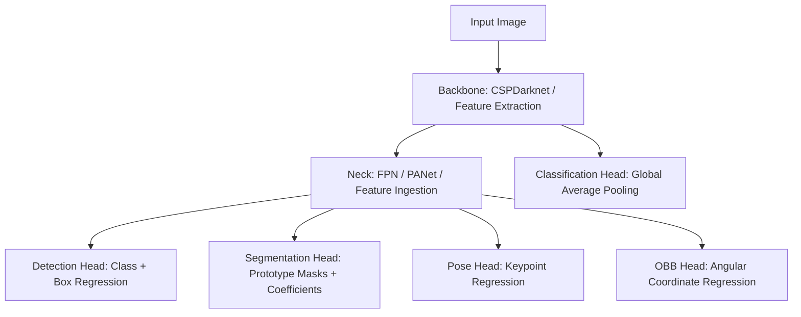

# 🧠 EX59: YOLO Multi-Task Modes

Historically, YOLO was designed strictly for **Object Detection**—locating objects via horizontal bounding boxes. Modern iterations (such as YOLOv8 and YOLOv11) have evolved into a unified **Multi-Task framework**. 

By sharing a common Feature Extractor (**Backbone** & **Neck**), YOLO can run different specialized prediction **Heads** to perform varied vision tasks. This design minimizes redundant calculations while providing a unified API for a wide range of computer vision challenges.

---

## 1. Mathematical and Theoretical Foundations of Multi-Task Learning

Multi-Task learning operates on the principle that low-level features (edges, textures, gradients) are common across all vision tasks. By sharing a backbone, we compile these features once and branch them into separate task-specific prediction heads.



### A. Instance Segmentation Head (YOLACT-style)
YOLO uses a dual-branch head for instance segmentation:
1.  **Proto-net Branch:** Generates a set of $k$ prototype masks $\mathbf{P} \in \mathbb{R}^{k \times H_{mask} \times W_{mask}}$ for the entire image.
2.  **Detection Head Branch:** Predicts $k$ mask coefficients $\mathbf{c} = [c_1, c_2, \dots, c_k]$ for each detected object.

The final mask $\mathbf{M}$ for an object is computed via a linear combination of prototypes followed by a sigmoid activation:

$$\mathbf{M} = \sigma\left( \sum_{i=1}^k c_i \mathbf{P}_i \right)$$

Where:
*   $\mathbf{P}_i$ is the $i$-th channel of the prototype tensor.
*   $\sigma(x) = \frac{1}{1 + e^{-x}}$ is the sigmoid activation mapping values to $[0.0, 1.0]$.

### B. Classification Head
Classification requires no box coordinates. The feature map $\mathbf{F} \in \mathbb{R}^{C \times H \times W}$ from the final backbone layer is summarized using Global Average Pooling (GAP) and projected onto $K$ classes:

$$\mathbf{z} = \mathbf{W} \cdot \left( \frac{1}{H \times W} \sum_{y=1}^H \sum_{x=1}^W \mathbf{F}_{:, y, x} \right) + \mathbf{b}$$
$$\mathbf{p}_j = \frac{e^{z_j}}{\sum_{i=1}^K e^{z_i}}$$

### C. Pose Head (Keypoint Regression)
For pose estimation, the model regresses the coordinates of $J$ joints or landmarks $(x_j, y_j)$ along with a visibility flag $v_j$. The loss is guided by the Object Keypoint Similarity (OKS) metric:

$$\text{OKS} = \exp\left( -\frac{d_i^2}{2 s^2 k_i^2} \right)$$

Where:
*   $d_i$ is the Euclidean distance between predicted and ground-truth keypoints.
*   $s$ is the object scale (square root of bounding box area).
*   $k_i$ is a per-keypoint constant (controls sensitivity based on joint type).

### D. Oriented Bounding Boxes (OBB)
Oriented bounding boxes capture rotated objects by adding an angle parameter $\theta$ to the coordinates:

$$\mathbf{B}_{obb} = [x_c, y_c, w, h, \theta]$$

To avoid boundary discontinuity problems during optimization (e.g., when the angle wraps around at $\pm\pi/2$), YOLO regresses trigonometric parameters (e.g., $\sin\theta, \cos\theta$) rather than raw angles.

---

## 2. Task-Specific Configuration Parameters

When initializing and training multi-task models, several parameters control how masks, keypoints, and OBB coordinates are parsed:

| Parameter | Type | Default Value | Range / Choices | Deep Technical Explanation |
| :--- | :--- | :--- | :--- | :--- |
| `task` | `str` | `'detect'` | `'detect'`, `'segment'`, `'classify'`, `'pose'`, `'obb'` | Explicitly specifies the task type. |
| `mask_ratio` | `int` | `4` | $[1, \infty)$ | Downsampling factor for segmentation masks (e.g., `mask_ratio=4` yields masks at $1/4$ resolution to save VRAM). |
| `overlap_mask` | `bool` | `True` | `True`, `False` | Determines whether overlapping segmentation masks are merged or kept separate. |
| `retina_masks` | `bool` | `False` | `True`, `False` | Activates high-resolution mask generation at the native image size. |

---

## 3. Python vs. CLI Code Comparison

### Python API Usage
```python
from ultralytics import YOLO

# 1. Detection
model_det = YOLO("yolo11n.pt")
res_det = model_det("demo.jpg")[0]

# 2. Segmentation
model_seg = YOLO("yolo11n-seg.pt")
res_seg = model_seg("demo.jpg")[0]
if res_seg.masks is not None:
    polygons = res_seg.masks.xy  # Mask polygon coordinates

# 3. Pose
model_pose = YOLO("yolo11n-pose.pt")
res_pose = model_pose("demo.jpg")[0]
if res_pose.keypoints is not None:
    kpts = res_pose.keypoints.xy.cpu().numpy()  # [N, num_kpts, 2]
```

### CLI Usage
```bash
# Object Detection
yolo detect predict model=yolo11n.pt source="demo.jpg"

# Instance Segmentation
yolo segment predict model=yolo11n-seg.pt source="demo.jpg"

# Pose Estimation
yolo pose predict model=yolo11n-pose.pt source="demo.jpg"
```

---

## 💡 Professor Tips

### 1. Deciding Between Segmentation and OBB
*   **Oriented Bounding Boxes (OBB)** are ideal for rectangular, diagonal objects (e.g., ships or cars in aerial photography) where standard boxes capture too much background noise, but pixel-perfect segmentations are not needed. OBB is faster than segmentation because it only regresses an angle parameter instead of generating a 2D mask.
*   **Instance Segmentation** should be selected only when you require the exact pixel-level shape, boundary, or area of objects.

### 2. VRAM Trade-offs of `retina_masks`
During validation or prediction with instance segmentation, setting `retina_masks=True` forces mask generation at the native resolution (e.g., $1024\times1024$ or higher) instead of the downscaled network resolution. While this yields smoother edges on small boundaries, it increases VRAM utilization and post-processing latency dramatically. Set `retina_masks=False` (default) for edge deployments.

---
*Related Topics:*
*   [[EX58_Model_Export|EX58: Model Export & Optimization]]
*   [[EX60_Streaming_Inference|EX60: Streaming Inference]]
*   Return to main plan: [[YOLO_Learning_Plan]]
*   Progress log: [[learning_journal]]
