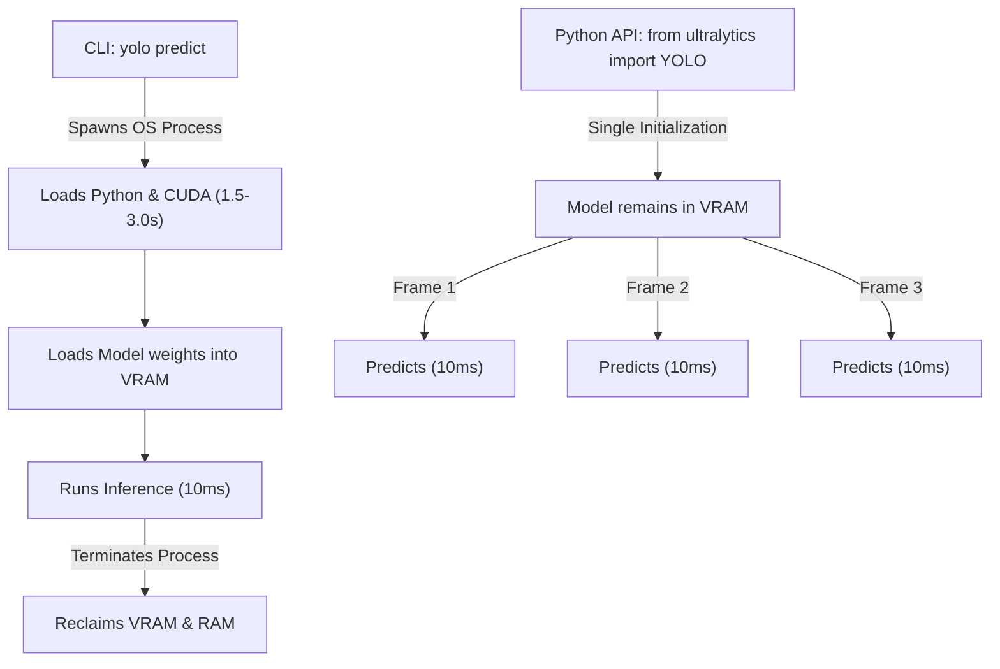

# 📘 YOLO Python API Master Guide

Welcome to production-grade Computer Vision engineering! This guide focuses on importing and controlling **Ultralytics YOLO** directly within Python scripts, emphasizing direct API integrations rather than CLI wrappers or subprocess executions.

---

## 🏗️ 1. Why Python API Over CLI in Production?

In production computer vision pipelines, calling YOLO via CLI commands or subprocess wrappers (e.g. `yolo detect predict ...` or `os.system`) is a major bottleneck:



1.  **Eliminates Cold-Start Latency:** Every CLI invocation requires PyTorch and CUDA driver initialization, introducing a **1.5 to 3.0 second** cold-start delay before processing a single image. The Python API initializes once and processes subsequent images in **sub-milliseconds**.
2.  **Direct Memory Access:** CLI runs output results to disk (saving images or text coordinates), forcing your application to execute secondary I/O reads. The Python API yields results directly as in-memory tensors, enabling instant downstream decisions.
3.  **VRAM Management:** Python API keeps model weights resident in GPU memory, preventing constant hardware-reallocation overhead.

---

## 🚀 2. Importing and Instantiating Models

To load YOLO inside your Python script, import and instantiate the `YOLO` class:

```python
from ultralytics import YOLO

# 1. Load production weights (.pt)
# Automatically checks for GPU availability and allocates VRAM
model = YOLO("yolo26n.pt")

# View class dictionary metadata
print(f"Supported classes: {model.names}")
```

---

## 📈 3. Deep-Dive Model Training via Python API

Fine-tuning your custom YOLO model directly in Python allows you to capture evaluation metrics programmatically:

```python
from ultralytics import YOLO
import torch

def train_yolo_pipeline():
    # Detect target hardware
    device = 0 if torch.cuda.is_available() else "cpu"
    
    # Load base weights
    model = YOLO("yolo26n.pt")
    
    # Run training using custom parameters
    # Do not call subprocess wrappers for model training!
    results = model.train(
        data="datasets/custom_data/data.yaml",  # Custom dataset config
        epochs=100,                             # Total epochs
        batch=16,                               # Batch size
        imgsz=640,                              # Image resolution
        device=device,                          # Target device
        amp=True,                               # Mixed-precision (FP16 VRAM Saving)
        workers=4,                              # CPU dataloading threads
        project="PTT_Inspection",               # Project tracking directory
        name="valve_detection_run",             # Experiment identifier
        freeze=10                               # Freeze backbone layers
    )
    
    print(f"Training results saved to directory: {results.save_dir}")

if __name__ == "__main__":
    train_yolo_pipeline()
```

---

## 🎯 4. Detailed Box Parsing and Tensor Extraction

Extracting bounding box predictions directly from PyTorch tensors using the API:

```python
import cv2
from ultralytics import YOLO

# 1. Instantiate the model
model = YOLO("yolo26n.pt")

# 2. Run inference on a NumPy image array
img = cv2.imread("pipeline_valve.jpg")
results = model.predict(source=img, save=False, conf=0.25)

# 3. Get the first Results object
result = results[0]

# 4. Iterate over detected boxes
if result.boxes is not None:
    for box in result.boxes:
        # Extract Corner Coordinates [xmin, ymin, xmax, ymax]
        # Move tensor from GPU VRAM to CPU RAM and convert to numpy
        xyxy = box.xyxy[0].cpu().numpy().tolist()
        xmin, ymin, xmax, ymax = map(int, xyxy)
        
        # Extract Center-Size Coordinates [x_center, y_center, width, height]
        xywh = box.xywh[0].cpu().numpy().tolist()
        xc, yc, w, h = xywh
        
        # Get scalar confidence and class index
        confidence = float(box.conf[0].cpu().item())
        class_id = int(box.cls[0].cpu().item())
        class_name = model.names[class_id]
        
        print(f"Detected: {class_name} ({confidence * 100:.2f}%)")
        print(f"  -> Corner coordinates: [{xmin}, {ymin}, {xmax}, {ymax}]")
        print(f"  -> Center-size coordinates: xc={xc:.2f}, yc={yc:.2f}, w={w:.2f}, h={h:.2f}")
```

---

## 📹 5. Memory-Safe Streaming Inference

For processing long video files, always use generator-mode via `stream=True` to maintain $O(1)$ memory consumption:

```python
from ultralytics import YOLO

model = YOLO("yolo26n.pt")

# Runs frame-by-frame and discards processed frames immediately
video_stream = model.predict(
    source="cctv_pipeline_feed.mp4",
    stream=True,
    conf=0.3,
    save=False
)

for frame_idx, result in enumerate(video_stream):
    print(f"--- Frame {frame_idx} ---")
    if result.boxes is not None:
        print(f"Detections in current frame: {len(result.boxes)}")
        # Get BGR frame with annotated bounding boxes overlaid
        annotated_image = result.plot()
        # Pass annotated_image to OpenCV display or streaming sinks
```

---

## ⚙️ 6. Exporting and Reloading Optimized Models

To accelerate deployment speed, export PyTorch checkpoints (`.pt`) to ONNX or TensorRT, and reload them under the same Python class structure:

```python
from ultralytics import YOLO

# 1. Load PyTorch model
model_pt = YOLO("yolo26n.pt")

# 2. Export to FP16 ONNX format
onnx_file_path = model_pt.export(format="onnx", half=True)
print(f"ONNX model saved to: {onnx_file_path}")

# 3. Reload ONNX file directly using the same YOLO class
# The backend automatically routes inference through ONNX Runtime!
model_onnx = YOLO(onnx_file_path)
results = model_onnx.predict(source="pipeline_valve.jpg", save=True)
```

---

## 💡 Professor Tips: Garbage Collection and VRAM Clearance
When loading and unloading multiple models inside a Python loop, memory leaks can occur. Use this workflow to clear VRAM fully:

```python
import gc
import torch
from ultralytics import YOLO

# 1. Instantiate and delete
model = YOLO("yolo26n.pt")
# ... run pipeline ...
del model

# 2. Force Python Garbage Collection
gc.collect()

# 3. Empty CUDA Cache
if torch.cuda.is_available():
    torch.cuda.empty_cache()
```
---
*Related Topics:*
*   [[EX51_YOLO_CLI|EX51: YOLO Command Line Interface (CLI)]]
*   [[EX52_Model_Configurations|EX52: Model Configurations]]
*   [[EX53_Training_Settings|EX53: Training Settings]]
*   Return to main plan: [[YOLO_Learning_Plan]]
