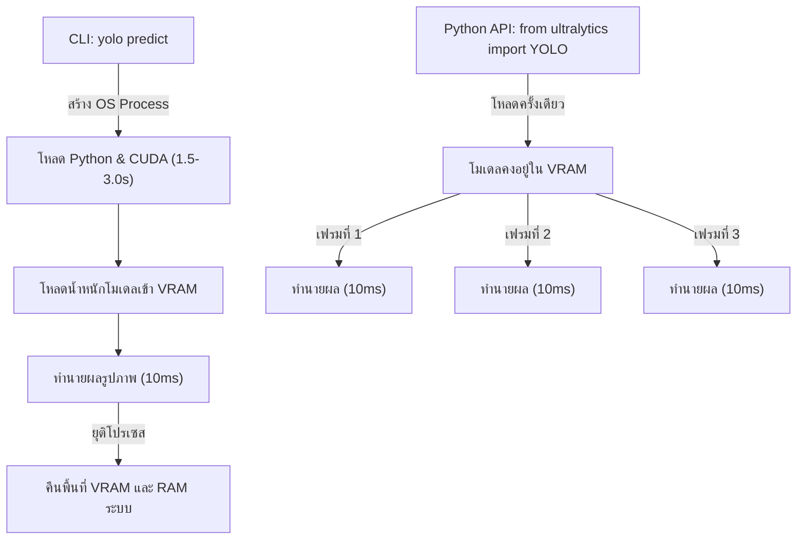

# 📘 คู่มือการใช้งาน YOLO Python API ฉบับสมบูรณ์ (YOLO Python API Master Guide)

ยินดีต้อนรับสู่อาณาจักรการพัฒนาแอปพลิเคชันคอมพิวเตอร์วิทัศน์ระดับโปรดักชัน! คู่มือฉบับนี้จัดทำขึ้นเพื่อมุ่งเน้นการเขียนโค้ดภาษา Python เพื่อนำเข้า (import) และควบคุม **Ultralytics YOLO** โดยตรงผ่านทางโปรแกรมจริง หลีกเลี่ยงการใช้คำสั่งเลียนแบบ (mockups) หรือการเรียกใช้คำสั่งบรรทัดคำสั่ง (CLI) ผ่านทาง `subprocess` ที่ก่อให้เกิดความล่าช้าในการประมวลผลสูง

---

## 🏗️ 1. ทำไมต้องใช้ Python API แทนการเรียกรันคำสั่ง CLI?

ในกระบวนการทำงานระดับอุตสาหกรรม การรันคำสั่งตรวจจับผ่าน CLI (เช่นการพิมพ์ `yolo detect predict ...` ในเทอร์มินัลหรือเรียกผ่าน `os.system`) ถือเป็นวิธีปฏิบัติที่สร้างปัญหาคอขวด (bottleneck) ดังนี้:



1.  **ลดความหน่วงเวลาเริ่มต้น (Cold-Start Latency):** ทุกครั้งที่เรียก CLI ระบบต้องเริ่มนับหนึ่งกระบวนการนำเข้า PyTorch และเปิดใช้งานพอร์ต CUDA ใหม่ตั้งแต่ต้น ใช้เวลาหน่วงประมาณ **1.5 ถึง 3.0 วินาที** สำหรับการทำนายภาพเพียงภาพเดียว ขณะที่การรันผ่าน Python API จะทำเพียงครั้งเดียวและรันเฟรมต่อๆ ไปได้ทันทีด้วยเวลาหน่วงระดับ **มิลลิวินาที (sub-millisecond)**
2.  **การสื่อสารระหว่างกระบวนการ (Inter-Process Communication):** การเรียกผ่าน CLI จะได้ผลลัพธ์เป็นไฟล์รูปภาพเซฟบนดิสก์ ซึ่งทำให้แอปพลิเคชันต้องเปิดอ่านดิสก์อีกครั้งเพื่อดึงพิกัด ในขณะที่ Python API จะคืนผลลัพธ์เป็นเทนเซอร์ตัวแปรในหน่วยความจำโดยตรง ทำให้รันตรรกะควบคุมถัดไปได้ทันที
3.  **การจัดเก็บหน่วยความจำ (VRAM Retention):** Python API สามารถรักษาโมเดลให้อยู่บน VRAM ของ GPU ไว้ได้ตลอดเวลา ช่วยป้องกันการจองและปล่อยพื้นที่หน่วยความจำซ้ำซากที่ทำให้การ์ดจอทำงานหนัก

---

## 🚀 2. การนำเข้าและเตรียมวัตถุโมเดล (Import & Instantiation)

ขั้นตอนการเขียนนำเข้า YOLO เข้ามาใช้งานและสร้างออบเจกต์ทำได้โดยระบุคลาส `YOLO` จากแพ็กเกจ `ultralytics`:

```python
from ultralytics import YOLO

# 1. โหลดค่าน้ำหนักพรีเทรนระดับโปรดักชัน (.pt)
# อิมพอร์ตและจองพื้นที่หน่วยความจำ VRAM อัตโนมัติบน GPU (หากพร้อมใช้งาน)
model = YOLO("yolo26n.pt")

# ตรวจสอบชื่อคลาสวัตถุที่รองรับ
print(f"รายชื่อคลาสที่ตรวจจับได้ทั้งหมด: {model.names}")
```

---

## 📈 3. การฝึกสอนโมเดลในระดับลึกผ่าน Python (Deep-Dive Model Training)

การรันฝึกสอนโดยใช้ API ช่วยให้คุณสามารถเข้าถึงข้อมูลสถิติและผลลัพธ์ได้โดยตรงเพื่อทำโปรแกรมควบคุมต่อ:

```python
from ultralytics import YOLO
import torch

def train_yolo_pipeline():
    # ตรวจสอบว่าระบบมี GPU หรือไม่
    device = 0 if torch.cuda.is_available() else "cpu"
    
    # โหลดโมเดล
    model = YOLO("yolo26n.pt")
    
    # เริ่มกระบวนการฝึกสอนจริงด้วยคอนฟิกูเรชันขั้นสูง
    # ห้ามเขียนเรียกใช้ CLI ผ่านคำสั่ง subprocess.run เพื่อทำการเทรนโมเดลเด็ดขาด!
    results = model.train(
        data="datasets/custom_data/data.yaml",  # คอนฟิกชุดข้อมูลของอุตสาหกรรม
        epochs=100,                             # จำนวนรอบ
        batch=16,                               # ขนาดแบทช์
        imgsz=640,                              # ความละเอียดภาพ
        device=device,                          # ระบุอุปกรณ์จริง
        amp=True,                               # เปิดการคำนวณแบบผสม (FP16 VRAM Saving)
        workers=4,                              # เธรดโหลดข้อมูลของ CPU
        project="PTT_Inspection",               # ชื่อโปรเจกต์ในการบันทึก
        name="valve_detection_run",             # ชื่อรอบย่อย
        freeze=10                               # แช่แข็งโครงสร้างส่วนสกัดคุณลักษณะเลเยอร์ต้นๆ
    )
    
    # ดึงพาธไดเรกทอรีที่ผลการเทรนบันทึกสำเร็จ
    print(f"ผลลัพธ์การฝึกสอนบันทึกเสร็จสิ้นที่โฟลเดอร์: {results.save_dir}")

if __name__ == "__main__":
    train_yolo_pipeline()
```

---

## 🎯 4. การประมวลผลทำนายและดึงพิกัดแบบละเอียด (Detailed Box Parsing)

เมื่อโมเดลทำนายเสร็จแล้ว ผลลัพธ์ที่ได้จะอยู่ในออบเจกต์ `Results` ซึ่งเราต้องดึงค่าเทนเซอร์ออกมาใช้งานจริง ไม่ใช้การเดาสุ่ม:

```python
import cv2
from ultralytics import YOLO

# 1. โหลดโมเดลสำหรับนำไปใช้จริง
model = YOLO("yolo26n.pt")

# 2. ทำนายภาพ (ส่งผ่านเป็นอาร์เรย์รูปภาพ OpenCV หรือพาธของภาพก็ได้)
img = cv2.imread("pipeline_valve.jpg")
results = model.predict(source=img, save=False, conf=0.25)

# 3. ดึงผลลัพธ์ภาพแรก (จากลิสต์การประมวลผลแบทช์)
result = results[0]

# 4. ลูปเพื่ออ่านพิกัดกล่องทีละชิ้นส่วนที่ตรวจพบ
if result.boxes is not None:
    for box in result.boxes:
        # ดึงพิกัดขอบเขตแบบ Absolute Pixel (Corner Format: xmin, ymin, xmax, ymax)
        # จำเป็นต้องย้ายจาก VRAM ของ GPU ไปยัง RAM ปกติ และแปลงเป็นอาร์เรย์ NumPy/List
        xyxy = box.xyxy[0].cpu().numpy().tolist()
        xmin, ymin, xmax, ymax = map(int, xyxy)
        
        # ดึงพิกัดกึ่งกลางและสัดส่วน (x_center, y_center, width, height)
        xywh = box.xywh[0].cpu().numpy().tolist()
        xc, yc, w, h = xywh
        
        # ดึงความมั่นใจและคลาสไอดีจริง
        confidence = float(box.conf[0].cpu().item())
        class_id = int(box.cls[0].cpu().item())
        class_name = model.names[class_id]
        
        print(f"ตรวจพบวัตถุ: {class_name} ({confidence * 100:.2f}%)")
        print(f"  -> พิกัดพิกเซล: [{xmin}, {ymin}, {xmax}, {ymax}]")
        print(f"  -> พิกัดนอร์มัลไลซ์จุดศูนย์กลาง: xc={xc:.2f}, yc={yc:.2f}, w={w:.2f}, h={h:.2f}")
```

---

## 📹 5. การตรวจจับวัตถุบนสตรีมวิดีโออย่างมีเสถียรภาพ (Memory-Safe Streaming)

หากต้องรันการทำนายผลวิดีโอที่มีความยาวมาก การโหลดวิดีโอเข้ามาทั้งเรื่องเพื่อประมวลผลจะทำให้หน่วยความจำระบบเต็ม เราจำเป็นต้องรันในโหมดเครื่องกำเนิดตัวแปร (Generator) ผ่านพารามิเตอร์ `stream=True`:

```python
from ultralytics import YOLO

model = YOLO("yolo26n.pt")

# รันโหมดการประมวลผลภาพแบบสตรีม (stream=True)
# ระบบจะรันแบบอ่านเฟรมต่อเฟรมและปล่อยหน่วยความจำของเฟรมเก่าทิ้งทันที
video_stream = model.predict(
    source="cctv_pipeline_feed.mp4",
    stream=True,
    conf=0.3,
    save=False
)

for frame_idx, result in enumerate(video_stream):
    print(f"--- เฟรมที่ {frame_idx} ---")
    if result.boxes is not None:
        print(f"ตรวจพบวัตถุทั้งหมดในเฟรม: {len(result.boxes)} ชิ้น")
        # ดึงภาพผลลัพธ์ที่วาดกล่องครอบทับมาใช้งาน
        annotated_image = result.plot()
        # นำไปแสดงผลหรือส่งผ่านสตรีมมิ่งต่อตามต้องการ
```

---

## ⚙️ 6. การส่งออกและนำโมเดลที่ปรับจูนความเร็วกลับมาใช้งาน (Optimized Model Reloading)

กระบวนการส่งออกโมเดลต้นฉบับ PyTorch ไปเป็นสเปกความเร็วสูงอย่าง ONNX หรือ TensorRT และโหลดไฟล์ดังกล่าวกลับเข้ามาใช้งานผ่าน API ตัวเดิม:

```python
from ultralytics import YOLO

# 1. โหลดโมเดล PyTorch ดั้งเดิม
model_pt = YOLO("yolo26n.pt")

# 2. ส่งออกเป็น ONNX แบบ FP16 ความเร็วสูง
# เมธอดจะคำนวณกราฟประมวลผลใหม่และส่งพาธของไฟล์กลับคืนมา
onnx_file_path = model_pt.export(format="onnx", half=True)
print(f"บันทึกไฟล์ส่งออกสำเร็จที่: {onnx_file_path}")

# 3. นำเข้าไฟล์ ONNX กลับมาเพื่อใช้งานทำนายผลทันที
# คลาส YOLO จะทำการวิเคราะห์และส่งต่อให้รันบนเอนจินของ ONNX Runtime โดยอัตโนมัติ!
model_onnx = YOLO(onnx_file_path)
results = model_onnx.predict(source="pipeline_valve.jpg", save=True)
```

---

## 💡 คำแนะนำระดับอาจารย์สำหรับการบริหารหน่วยความจำ GPU
เมื่อพัฒนาแอปพลิเคชันที่มีการทำลายและสร้างออบเจกต์โมเดลสลับกันไปมาใน Python คุณอาจเจอปัญหาหน่วยความจำของ GPU เต็ม (VRAM Leak) แนะนำให้ใช้กระบวนการดังนี้เพื่อเคลียร์หน่วยความจำโดยสมบูรณ์:

```python
import gc
import torch
from ultralytics import YOLO

# 1. ลบออบเจกต์ออกจากระบบอ้างอิง
model = YOLO("yolo26n.pt")
# ... รันกระบวนการเสร็จสิ้น ...
del model

# 2. สั่งรันการทำความสะอาดหน่วยความจำของ Python
gc.collect()

# 3. ล้างแคชจัดสรร VRAM ของการ์ดจอคืนสู่ระบบปฏิบัติการ
if torch.cuda.is_available():
    torch.cuda.empty_cache()
```
---
*หัวข้อที่เกี่ยวข้อง:*
*   [[EX51_YOLO_CLI_TH|EX51: อินเตอร์เฟซบรรทัดคำสั่ง YOLO (YOLO CLI)]]
*   [[EX52_Model_Configurations_TH|EX52: คอนฟิกูเรชันของโมเดล (Model Configurations)]]
*   [[EX53_Training_Settings_TH|EX53: การตั้งค่าการฝึกสอน (Training Settings)]]
*   กลับสู่สารบัญหลัก: [[YOLO_Learning_Plan|แผนการเรียน YOLO]]
