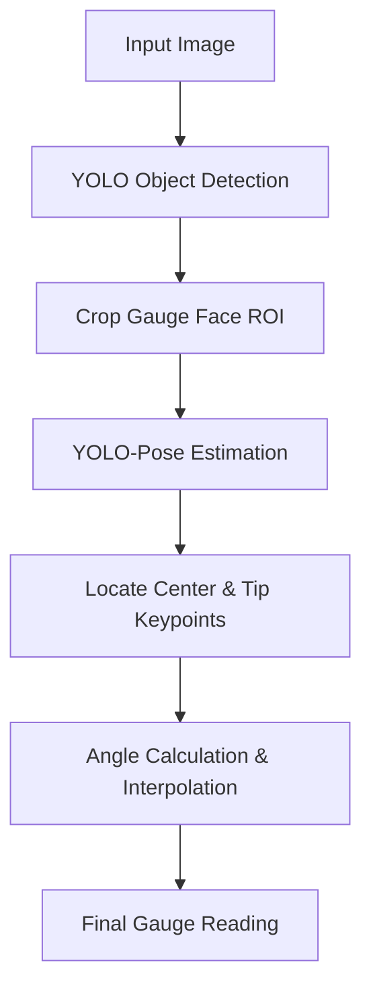

# 🧠 EX65: Analog Gauge Reader

Analog gauges (pressure, temperature, flow rate) are ubiquitous in industrial environments. Reading them automatically using computer vision is a classic and valuable task. In this exercise, we will design a **cascaded model pipeline** that first detects the gauge face using YOLO object detection, crops the region of interest (ROI), and then applies a YOLO-Pose estimation model to locate the needle's pivot center and its tip. Finally, we will use trigonometry and linear interpolation to compute the actual reading.

---

## 1. Cascaded Pipeline Architecture

Deploying a single model to detect a tiny needle on a small gauge within a large, complex high-resolution scene is highly prone to errors. A **cascaded (two-stage) pipeline** solves this:

1. **Stage 1 (Object Detection)**: A YOLO model is trained to detect the gauge face. The detected bounding box is cropped.
2. **Stage 2 (Pose Estimation)**: A YOLO-Pose model is trained *specifically* on cropped gauge faces to locate two keypoints:
   * **Keypoint 0**: Needle Pivot Center ($C_x, C_y$)
   * **Keypoint 1**: Needle Tip ($T_x, T_y$)



---

## 2. Mathematical Interpretation of the Needle

Once keypoints are detected, the reading is extracted in two steps:

### A. Angle Calculation
We compute the needle's orientation angle relative to the horizontal axis. Since image coordinates have a downward-facing $y$-axis (top-left is $0,0$), we adjust the vertical difference:

$$\Delta x = T_x - C_x$$
$$\Delta y = T_y - C_y$$
$$\theta_{\text{rad}} = \text{arctan2}(-\Delta y, \Delta x)$$
$$\theta_{\text{deg}} = \theta_{\text{rad}} \times \frac{180}{\pi}$$

Using $\text{arctan2}$ ensures we resolve the angle in the correct quadrant across a full $360^\circ$ circle.

### B. Linear Interpolation (Calibration)
Every gauge has a zero calibration point ($\theta_{\text{min}}$ at value $V_{\text{min}}$) and a full-scale point ($\theta_{\text{max}}$ at value $V_{\text{max}}$). The reading $V$ is calculated using linear interpolation:

$$V = V_{\text{min}} + \frac{\theta - \theta_{\text{min}}}{\theta_{\text{max}} - \theta_{\text{min}}} \times (V_{\text{max}} - V_{\text{min}})$$

---

## 3. Python Code Demonstration

Here is a implementation of the cascaded gauge reading pipeline:

```python
import cv2
import numpy as np
import math
from ultralytics import YOLO

# 1. Load models
detector = YOLO('yolov8n.pt')          # Stage 1: Gauge Face Detector (Fine-tuned)
pose_estimator = YOLO('yolov8n-pose.pt') # Stage 2: Needle Pose Estimator (Fine-tuned)

def get_needle_reading(image_path, min_val=0.0, max_val=100.0, min_angle=-135.0, max_angle=135.0):
    img = cv2.imread(image_path)
    h, w, _ = img.shape
    
    # --- STAGE 1: Detect Gauge Face ---
    det_results = detector(img)[0]
    if len(det_results.boxes) == 0:
        print("No gauge detected!")
        return None
        
    # Assume the first detection is the gauge we want
    box = det_results.boxes[0].xyxy[0].cpu().numpy().astype(int)
    x1, y1, x2, y2 = box
    
    # Crop the gauge face with a small padding
    pad = 10
    crop_x1 = max(0, x1 - pad)
    crop_y1 = max(0, y1 - pad)
    crop_x2 = min(w, x2 + pad)
    crop_y2 = min(h, y2 + pad)
    gauge_crop = img[crop_y1:crop_y2, crop_x1:crop_x2]
    
    # --- STAGE 2: Pose Estimation on Crop ---
    pose_results = pose_estimator(gauge_crop)[0]
    if len(pose_results.keypoints) == 0:
        print("No needle detected in the cropped gauge face!")
        return None
        
    # Get keypoints (x, y) relative to crop
    kpts = pose_results.keypoints.xy[0].cpu().numpy()
    if len(kpts) < 2:
        print("Needle keypoints not fully detected!")
        return None
        
    center = kpts[0]  # Pivot center
    tip = kpts[1]     # Needle tip
    
    # --- STAGE 3: Trigonometry & Interpolation ---
    dx = tip[0] - center[0]
    # Invert dy because y increases downwards in image space
    dy = -(tip[1] - center[1])
    
    # Calculate angle in degrees
    angle = math.degrees(math.atan2(dy, dx))
    
    # Normalize angle to range matching min_angle and max_angle
    # For example, if angle is 270 deg, convert to -90 deg
    if angle > 180:
        angle -= 360
    elif angle < -180:
        angle += 360
        
    # Perform linear interpolation
    # Bound the angle to calibrated limits
    clamped_angle = max(min(angle, max_angle), min_angle)
    reading = min_val + ((clamped_angle - min_angle) / (max_angle - min_angle)) * (max_val - min_val)
    
    print(f"Detected Angle: {angle:.2f}° | Clamped: {clamped_angle:.2f}°")
    print(f"Computed Gauge Reading: {reading:.2f}")
    return reading

# Example Run
# reading = get_needle_reading('gauge.jpg', min_val=0, max_val=10.0, min_angle=-120, max_angle=120)
```

---

## 🛠️ Connection to Computer Vision & YOLO

*   **Resolution and Feature Loss**: When an input image is resized down to `640x640` for standard YOLO inference, small structures like a thin needle become blurry or disappear. Cascading keeps the aspect ratio and fine spatial details by cropping and passing a high-resolution sub-image to the second model.
*   **Coordinate Space Mapping**: When using keypoints from a cropped image, remember that they are local to the crop. To map them back to the original image coordinate space, add the crop offsets:
    $$X_{\text{global}} = X_{\text{local}} + X_{\text{crop\_start}}$$
    $$Y_{\text{global}} = Y_{\text{local}} + Y_{\text{crop\_start}}$$

---

*Related Topics:*
*   [[EX66_License_Plate_Recognition]]
*   Return to main plan: [[YOLO_Learning_Plan]]
*   Progress log: [[learning_journal]]
