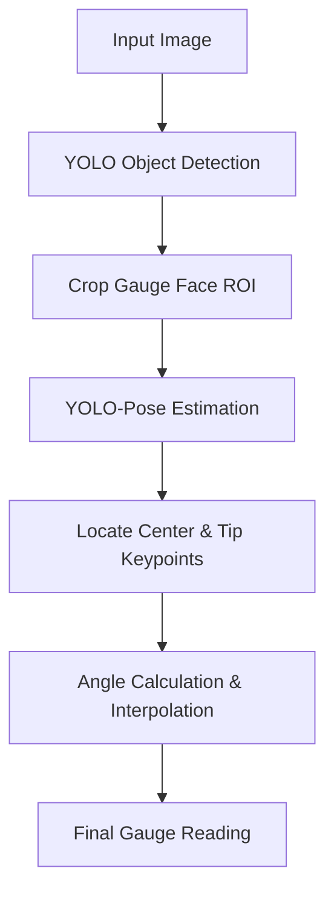

# 🧠 EX65: เครื่องอ่านเกจวัดอนาล็อก (Analog Gauge Reader)

เกจวัดแบบอนาล็อก (เช่น เกจวัดแรงดัน, อุณหภูมิ, อัตราการไหล) มีการใช้งานอย่างแพร่หลายในสภาพแวดล้อมทางอุตสาหกรรม การอ่านค่าเกจวัดเหล่านี้โดยอัตโนมัติด้วยระบบคอมพิวเตอร์วิทัศน์ถือเป็นโจทย์คลาสสิกที่มีคุณค่าสูง ในแบบฝึกหัดนี้ เราจะออกแบบ **ไปป์ไลน์โมเดลแบบเรียงต่อกัน (Cascaded Model Pipeline)** โดยใช้ YOLO ตรวจจับวัตถุเพื่อค้นหาหน้าปัดเกจวัดก่อน จากนั้นทำการครอปพื้นที่ภาพเฉพาะส่วนที่เป็นหน้าปัด (ROI) แล้วจึงส่งต่อให้โมเดลประมาณท่าทาง YOLO-Pose เพื่อหาจุดหมุนของเข็มและปลายเข็มวัด สุดท้ายเราจะใช้คณิตศาสตร์ตรีโกณมิติและการประมาณค่าเชิงเส้น (Linear Interpolation) เพื่อคำนวณค่าที่อ่านได้จริง

---

## 1. สถาปัตยกรรมของไปป์ไลน์แบบเรียงต่อกัน (Cascaded Pipeline Architecture)

การใช้โมเดลเดี่ยวๆ เพื่อตรวจจับปลายเข็มวัดขนาดเล็กในเกจวัดที่มีขนาดเล็กท่ามกลางภาพพื้นหลังขนาดใหญ่ที่มีความละเอียดสูง มักจะเกิดความผิดพลาดได้ง่ายมาก **ไปป์ไลน์แบบสองขั้นตอน (Two-stage Pipeline)** จึงถูกออกแบบมาเพื่อแก้ปัญหานี้:

1. **ขั้นตอนที่ 1 (การตรวจจับวัตถุ)**: ฝึกสอนโมเดล YOLO เพื่อตรวจจับหน้าปัดของเกจวัด จากนั้นจึงตัดครอบภาพ (Crop) บริเวณกล่องขอบเขต (Bounding Box) ที่ตรวจพบได้
2. **ขั้นตอนที่ 2 (การประมาณท่าทาง)**: ฝึกสอนโมเดล YOLO-Pose *เฉพาะ* บนภาพที่ครอปของหน้าปัดเกจวัด เพื่อระบุจุดสำคัญ (Keypoints) 2 จุด ได้แก่:
   * **จุดสำคัญ 0 (Keypoint 0)**: จุดศูนย์กลางการหมุนของเข็ม (Needle Pivot Center) ($C_x, C_y$)
   * **จุดสำคัญ 1 (Keypoint 1)**: ปลายเข็มวัด (Needle Tip) ($T_x, T_y$)



---

## 2. การตีความเข็มวัดทางคณิตศาสตร์ (Mathematical Interpretation of the Needle)

เมื่อตรวจพบจุดสำคัญแล้ว เราจะสกัดค่าที่อ่านได้ผ่าน 2 ขั้นตอนดังนี้:

### A. การคำนวณมุม (Angle Calculation)
เราจะคำนวณมุมการวางตัวของเข็มวัดเทียบกับแกนแนวนอน เนื่องจากพิกัดรูปภาพมีทิศทางแกน $y$ ชี้ลงด้านล่าง (มุมบนซ้ายคือจุด $0,0$) เราจึงต้องสลับเครื่องหมายผลต่างในแนวตั้งดังนี้:

$$\Delta x = T_x - C_x$$
$$\Delta y = T_y - C_y$$
$$\theta_{\text{rad}} = \text{arctan2}(-\Delta y, \Delta x)$$
$$\theta_{\text{deg}} = \theta_{\text{rad}} \times \frac{180}{\pi}$$

การใช้ฟังก์ชัน $\text{arctan2}$ จะช่วยให้เราได้มุมที่ถูกต้องในแต่ละจตุภาค (Quadrant) ตลอดวงกลม $360^\circ$

### B. การประมาณค่าเชิงเส้น (Linear Interpolation / Calibration)
เกจวัดทุกตัวจะมีจุดปรับเทียบเริ่มต้นศูนย์ ($\theta_{\text{min}}$ ที่สอดคล้องกับค่า $V_{\text{min}}$) และจุดปรับเทียบสเกลสูงสุด ($\theta_{\text{max}}$ ที่สอดคล้องกับค่า $V_{\text{max}}$) ค่าที่อ่านได้ $V$ จะคำนวณจากการประมาณค่าเชิงเส้น:

$$V = V_{\text{min}} + \frac{\theta - \theta_{\text{min}}}{\theta_{\text{max}} - \theta_{\text{min}}} \times (V_{\text{max}} - V_{\text{min}})$$

---

## 3. ตัวอย่างการเขียนโค้ดด้วย Python

นี่คือตัวอย่างการนำไปป์ไลน์สำหรับอ่านค่าเกจวัดแบบเรียงต่อกันไปใช้งาน:

```python
import cv2
import numpy as np
import math
from ultralytics import YOLO

# 1. Load models
detector = YOLO('yolov8n.pt')          # Stage 1: Gauge Face Detector (Fine-tuned)
pose_estimator = YOLO('yolov8n-pose.pt') # Stage 2: Needle Pose Estimator (Fine-tuned)

def get_needle_reading(image_path, min_val=0.0, max_val=100.0, min_angle=-135.0, max_angle=135.0):
    img = cv2.imread(image_path)
    h, w, _ = img.shape
    
    # --- STAGE 1: Detect Gauge Face ---
    det_results = detector(img)[0]
    if len(det_results.boxes) == 0:
        print("No gauge detected!")
        return None
        
    # Assume the first detection is the gauge we want
    box = det_results.boxes[0].xyxy[0].cpu().numpy().astype(int)
    x1, y1, x2, y2 = box
    
    # Crop the gauge face with a small padding
    pad = 10
    crop_x1 = max(0, x1 - pad)
    crop_y1 = max(0, y1 - pad)
    crop_x2 = min(w, x2 + pad)
    crop_y2 = min(h, y2 + pad)
    gauge_crop = img[crop_y1:crop_y2, crop_x1:crop_x2]
    
    # --- STAGE 2: Pose Estimation on Crop ---
    pose_results = pose_estimator(gauge_crop)[0]
    if len(pose_results.keypoints) == 0:
        print("No needle detected in the cropped gauge face!")
        return None
        
    # Get keypoints (x, y) relative to crop
    kpts = pose_results.keypoints.xy[0].cpu().numpy()
    if len(kpts) < 2:
        print("Needle keypoints not fully detected!")
        return None
        
    center = kpts[0]  # Pivot center
    tip = kpts[1]     # Needle tip
    
    # --- STAGE 3: Trigonometry & Interpolation ---
    dx = tip[0] - center[0]
    # Invert dy because y increases downwards in image space
    dy = -(tip[1] - center[1])
    
    # Calculate angle in degrees
    angle = math.degrees(math.atan2(dy, dx))
    
    # Normalize angle to range matching min_angle and max_angle
    # For example, if angle is 270 deg, convert to -90 deg
    if angle > 180:
        angle -= 360
    elif angle < -180:
        angle += 360
        
    # Perform linear interpolation
    # Bound the angle to calibrated limits
    clamped_angle = max(min(angle, max_angle), min_angle)
    reading = min_val + ((clamped_angle - min_angle) / (max_angle - min_angle)) * (max_val - min_val)
    
    print(f"Detected Angle: {angle:.2f}° | Clamped: {clamped_angle:.2f}°")
    print(f"Computed Gauge Reading: {reading:.2f}")
    return reading

# Example Run
# reading = get_needle_reading('gauge.jpg', min_val=0, max_val=10.0, min_angle=-120, max_angle=120)
```

---

## 🛠️ การประยุกต์ใช้ใน Computer Vision & YOLO

*   **การสูญเสียความละเอียดและฟีเจอร์ (Resolution & Feature Loss)**: เมื่อรูปภาพขนาดใหญ่ถูกย่อขนาดลงเหลือ `640x640` พิกเซลเพื่อป้อนเข้าสู่โมเดลตรวจจับมาตรฐานของ YOLO รายละเอียดขนาดเล็กอย่างเข็มวัดที่บางเฉียบจะเบลอหรือเลือนหายไป การจัดลำดับแบบเรียงต่อกันช่วยรักษาอัตราส่วนภาพและรายละเอียดเชิงพื้นที่ไว้ได้เป็นอย่างดี โดยการครอปรูปและส่งรูปภาพย่อยที่มีความละเอียดสูงไปให้โมเดลที่สองประมวลผลต่อ
*   **การแปลงระบบพิกัดพื้นที่ภาพ (Coordinate Space Mapping)**: เมื่อใช้จุดสำคัญจากรูปภาพที่ครอปมา พึงระลึกไว้เสมอว่าจุดสำคัญเหล่านั้นเป็นพิกัดอิงตามพื้นที่ที่ถูกครอป หากต้องการแปลงกลับไปเป็นพิกัดของรูปภาพต้นฉบับ จะต้องบวกค่าออฟเซ็ตของการครอปกลับเข้าไปด้วย:
    $$X_{\text{global}} = X_{\text{local}} + X_{\text{crop\_start}}$$
    $$Y_{\text{global}} = Y_{\text{local}} + Y_{\text{crop\_start}}$$

---

*หัวข้อที่เกี่ยวข้อง:*
*   [[EX66_License_Plate_Recognition_TH\|EX66: การจดจำป้ายทะเบียนรถ (License Plate Recognition)]]
*   กลับสู่แผนการเรียนหลัก: [[YOLO_Learning_Plan\|แผนการเรียน YOLO]]
*   บันทึกความก้าวหน้า: [[learning_journal\|บันทึกการเรียนรู้]]
