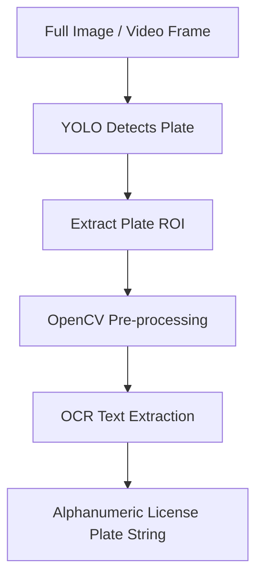

# 🧠 EX66: License Plate Recognition (LPR)

License Plate Recognition (LPR), also known as Automatic Number Plate Recognition (ANPR), is widely used in toll collection, smart parking, and traffic enforcement. Building an LPR system requires combining object detection (to locate the plate) with Optical Character Recognition (OCR) to read the text. In this exercise, we will build a robust LPR pipeline using YOLO for license plate detection, OpenCV for crop pre-processing, and Tesseract OCR for text extraction.

---

## 1. LPR Pipeline Architecture

An effective LPR system separates the "where" (detection) from the "what" (recognition). Trying to read characters directly from a full traffic scene is highly inefficient. Instead, we use a three-stage pipeline:



1.  **Stage 1: Plate Detection (YOLO)**: A standard bounding box detector locates the license plate in the image.
2.  **Stage 2: Pre-processing (OpenCV)**: The raw plate crop is often low-resolution, noisy, or poorly lit. Pre-processing prepares the characters for OCR.
3.  **Stage 3: OCR Engine**: The pre-processed binary image is parsed by an OCR engine (such as Tesseract, EasyOCR, or a CRNN) to output text.

---

## 2. Pre-processing the Plate Crop for High OCR Accuracy

OCR engines are highly sensitive to contrast, resolution, and noise. Running OCR on raw RGB crops from YOLO often yields garbled output. Applying the following pre-processing steps is critical:

*   **Grayscaling**: Removes color information, simplifying the image representation.
*   **Rescaling (Upsampling)**: Resizing the crop (e.g., doubling the size using bilinear interpolation) gives the OCR engine more pixels per character.
*   **Binarization (Thresholding)**: Converts the image to stark black and white (binary). We use **Otsu's Thresholding** or **Adaptive Thresholding** to separate text from background, ignoring uneven lighting conditions.
*   **Denoising (Morphological Operations)**: Using Gaussian blur or morphological opening/closing to eliminate small artifacts like screw heads, dirt, or border frames.

---

## 3. Python Code Demonstration

Here is a implementation combining YOLOv8 and Tesseract OCR:

```python
import cv2
import pytesseract
from ultralytics import YOLO

# Load the fine-tuned YOLO model for plate detection
# In a real scenario, this would be a custom trained YOLO model on a plate dataset
detector = YOLO('yolov8n.pt') 

def preprocess_plate_crop(crop):
    """Applies computer vision filters to optimize text readability for OCR."""
    # 1. Convert to Grayscale
    gray = cv2.cvtColor(crop, cv2.COLOR_BGR2GRAY)
    
    # 2. Upsample / Resize (usually double the size to help OCR engine)
    gray = cv2.resize(gray, None, fx=2.0, fy=2.0, interpolation=cv2.INTER_CUBIC)
    
    # 3. Apply Gaussian Blur to reduce high-frequency noise
    blur = cv2.GaussianBlur(gray, (5, 5), 0)
    
    # 4. Binarization using Otsu's Thresholding
    _, thresh = cv2.threshold(blur, 0, 255, cv2.THRESH_BINARY + cv2.THRESH_OTSU)
    
    # 5. Optional Morphological Operation to clean up borders
    kernel = cv2.getStructuringElement(cv2.MORPH_RECT, (3, 3))
    processed = cv2.morphologyEx(thresh, cv2.MORPH_CLOSE, kernel)
    
    return processed

def recognize_license_plate(image_path):
    img = cv2.imread(image_path)
    h, w, _ = img.shape
    
    # Detect license plates
    results = detector(img)[0]
    
    for box in results.boxes:
        # Check if the class is license plate (assuming class index 0 is 'plate' in custom model)
        # For yolov8n.pt, we can check for 'car'/'truck' or assume custom classes
        x1, y1, x2, y2 = box.xyxy[0].cpu().numpy().astype(int)
        
        # Crop the plate from the original image
        plate_crop = img[y1:y2, x1:x2]
        
        # Pre-process the crop
        processed_crop = preprocess_plate_crop(plate_crop)
        
        # Configure Tesseract
        # --psm 7 tells Tesseract to treat the image as a single text line
        # --oem 3 uses the default Neural Network LSTM engine
        custom_config = r'--oem 3 --psm 7 -c tessedit_char_whitelist=ABCDEFGHIJKLMNOPQRSTUVWXYZ0123456789-'
        
        # Perform OCR
        text = pytesseract.image_to_string(processed_crop, config=custom_config)
        text = text.strip()
        
        # Draw bounding box and predicted text on the image
        cv2.rectangle(img, (x1, y1), (x2, y2), (0, 255, 0), 2)
        cv2.putText(img, text, (x1, y1 - 10), cv2.FONT_HERSHEY_SIMPLEX, 0.8, (0, 255, 0), 2)
        
        print(f"Detected Plate Text: {text}")
        
    return img
```

---

## 💡 Professor Tips

1.  **Perspective Correction (Warp Perspective)**: License plates are rarely photographed dead-on. They are often viewed from an angle. To drastically improve OCR accuracy, use **YOLO-Pose** or **Segment** to detect the four corners of the plate, then apply OpenCV's `cv2.getPerspectiveTransform` and `cv2.warpPerspective` to warp the plate into a flat, rectangular image before running OCR.
2.  **Character Whitelisting**: Most license plates only contain uppercase letters and numbers. By passing `-c tessedit_char_whitelist=ABCDEFGHIJKLMNOPQRSTUVWXYZ0123456789` to Tesseract, you prevent it from misidentifying an `8` as a `B` (or vice versa) or outputting random special characters.
3.  **End-to-End Deep LPR**: For massive production systems, developers often replace generic OCR engines with custom deep-learning sequences like **CRNN** (Convolutional Recurrent Neural Networks) trained directly on license plate crops using **CTC Loss** (Connectionist Temporal Classification), which bypasses manual character segmentation.

---

*Related Topics:*
*   [[EX67_PPE_Compliance_Auditing]]
*   [[EX65_Analog_Gauge_Reader]]
*   Return to main plan: [[YOLO_Learning_Plan]]
*   Progress log: [[learning_journal]]
