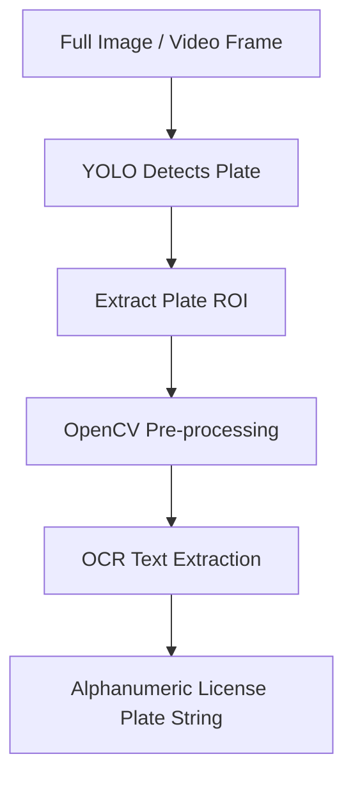

# 🧠 EX66: การจดจำป้ายทะเบียนรถ (License Plate Recognition)

การจดจำป้ายทะเบียนรถ (License Plate Recognition - LPR) หรือที่เรียกว่าการระบุตัวตนป้ายทะเบียนรถอัตโนมัติ (Automatic Number Plate Recognition - ANPR) มีการใช้งานอย่างแพร่หลายในระบบจัดเก็บค่าผ่านทาง ที่จอดรถอัจฉริยะ และการบังคับใช้กฎหมายจราจร การสร้างระบบ LPR จำเป็นต้องรวมการตรวจจับวัตถุ (เพื่อค้นหาตำแหน่งของป้ายทะเบียน) เข้ากับการจดจำอักขระด้วยแสง (Optical Character Recognition - OCR) เพื่ออ่านข้อความบนป้าย ในแบบฝึกหัดนี้ เราจะสร้างไปป์ไลน์ LPR ที่มีประสิทธิภาพโดยใช้ YOLO สำหรับการตรวจจับป้ายทะเบียน, OpenCV สำหรับการเตรียมความพร้อมรูปภาพ (Crop Pre-processing) และ Tesseract OCR สำหรับการดึงข้อความออกมา

---

## 1. สถาปัตยกรรมของไปป์ไลน์ LPR (LPR Pipeline Architecture)

ระบบ LPR ที่มีประสิทธิภาพจะแยกขั้นตอนการหาตำแหน่ง ("ที่ไหน") ออกจากขั้นตอนการจดจำข้อความ ("คืออะไร") การพยายามอ่านตัวอักษรโดยตรงจากภาพถ่ายการจราจรมุมกว้างจะไม่มีประสิทธิภาพอย่างยิ่ง ดังนั้นเราจึงใช้ไปป์ไลน์แบบ 3 ขั้นตอนดังนี้:



1.  **ขั้นตอนที่ 1: การตรวจจับป้าย (Plate Detection - YOLO)**: โมเดลตรวจจับกล่องขอบเขตจะระบุตำแหน่งของป้ายทะเบียนรถในภาพ
2.  **ขั้นตอนที่ 2: การเตรียมความพร้อมรูปภาพ (Pre-processing - OpenCV)**: ภาพครอปป้ายทะเบียนดิบมักมีความละเอียดต่ำ มีสัญญาณรบกวน หรือแสงไม่สว่างพอ การประมวลผลล่วงหน้าจะช่วยปรับภาพตัวอักษรให้พร้อมสำหรับเครื่องมือ OCR
3.  **ขั้นตอนที่ 3: ระบบรู้จำข้อความ (OCR Engine)**: รูปภาพไบนารีที่ผ่านการประมวลผลแล้วจะถูกประมวลผลด้วยเครื่องมือ OCR (เช่น Tesseract, EasyOCR หรือ CRNN) เพื่อดึงตัวอักษรและตัวเลขออกมา

---

## 2. การประมวลผลล่วงหน้าเพื่อความแม่นยำของ OCR (Pre-processing for High OCR Accuracy)

ระบบ OCR ไวต่อคอนทราสต์ (ความต่างระดับสี), ความละเอียด และสัญญาณรบกวนในภาพเป็นอย่างมาก การรัน OCR บนภาพครอป RGB ดิบจาก YOLO มักจะได้ผลลัพธ์ที่ผิดพลาด การนำขั้นตอนการเตรียมความพร้อมรูปภาพเหล่านี้ไปใช้จึงสำคัญมาก:

*   **Grayscaling (การแปลงเป็นภาพโทนสีเทา)**: ลบข้อมูลสีออกเพื่อลดความซับซ้อนของรูปภาพ
*   **Rescaling (การปรับขยายขนาดภาพ)**: การขยายขนาดภาพที่ครอป (เช่น เพิ่มขนาดเป็นสองเท่าโดยใช้การประมาณค่าแบบ Bilinear Interpolation) ช่วยให้เครื่องมือ OCR มีพิกเซลต่อตัวอักษรมากขึ้น
*   **Binarization (การแปลงเป็นภาพขาวดำ)**: แปลงรูปภาพให้เป็นสีดำและขาวอย่างชัดเจน (Binary) เรานิยมใช้ **Otsu's Thresholding** หรือ **Adaptive Thresholding** เพื่อแยกความแตกต่างระหว่างตัวอักษรและพื้นหลัง โดยละเลยผลกระทบจากแสงที่ส่องสว่างไม่สม่ำเสมอ
*   **Denoising (การลดสัญญาณรบกวน)**: การใช้ตัวกรอง Gaussian Blur หรือตัวดำเนินการสัณฐานวิทยา (Morphological Operations) เพื่อกำจัดสิ่งรบกวนขนาดเล็ก เช่น หัวสกรู คราบสกปรก หรือขอบโครงป้ายทะเบียน

---

## 3. ตัวอย่างการเขียนโค้ดด้วย Python

นี่คือตัวอย่างการนำไปใช้งานโดยผสมผสาน YOLOv8 และ Tesseract OCR:

```python
import cv2
import pytesseract
from ultralytics import YOLO

# Load the fine-tuned YOLO model for plate detection
# In a real scenario, this would be a custom trained YOLO model on a plate dataset
detector = YOLO('yolov8n.pt') 

def preprocess_plate_crop(crop):
    """Applies computer vision filters to optimize text readability for OCR."""
    # 1. Convert to Grayscale
    gray = cv2.cvtColor(crop, cv2.COLOR_BGR2GRAY)
    
    # 2. Upsample / Resize (usually double the size to help OCR engine)
    gray = cv2.resize(gray, None, fx=2.0, fy=2.0, interpolation=cv2.INTER_CUBIC)
    
    # 3. Apply Gaussian Blur to reduce high-frequency noise
    blur = cv2.GaussianBlur(gray, (5, 5), 0)
    
    # 4. Binarization using Otsu's Thresholding
    _, thresh = cv2.threshold(blur, 0, 255, cv2.THRESH_BINARY + cv2.THRESH_OTSU)
    
    # 5. Optional Morphological Operation to clean up borders
    kernel = cv2.getStructuringElement(cv2.MORPH_RECT, (3, 3))
    processed = cv2.morphologyEx(thresh, cv2.MORPH_CLOSE, kernel)
    
    return processed

def recognize_license_plate(image_path):
    img = cv2.imread(image_path)
    h, w, _ = img.shape
    
    # Detect license plates
    results = detector(img)[0]
    
    for box in results.boxes:
        # Check if the class is license plate (assuming class index 0 is 'plate' in custom model)
        # For yolov8n.pt, we can check for 'car'/'truck' or assume custom classes
        x1, y1, x2, y2 = box.xyxy[0].cpu().numpy().astype(int)
        
        # Crop the plate from the original image
        plate_crop = img[y1:y2, x1:x2]
        
        # Pre-process the crop
        processed_crop = preprocess_plate_crop(plate_crop)
        
        # Configure Tesseract
        # --psm 7 tells Tesseract to treat the image as a single text line
        # --oem 3 uses the default Neural Network LSTM engine
        custom_config = r'--oem 3 --psm 7 -c tessedit_char_whitelist=ABCDEFGHIJKLMNOPQRSTUVWXYZ0123456789-'
        
        # Perform OCR
        text = pytesseract.image_to_string(processed_crop, config=custom_config)
        text = text.strip()
        
        # Draw bounding box and predicted text on the image
        cv2.rectangle(img, (x1, y1), (x2, y2), (0, 255, 0), 2)
        cv2.putText(img, text, (x1, y1 - 10), cv2.FONT_HERSHEY_SIMPLEX, 0.8, (0, 255, 0), 2)
        
        print(f"Detected Plate Text: {text}")
        
    return img
```

---

## 💡 คำแนะนำจากอาจารย์ (Professor Tips)

1.  **การปรับมุมมองภาพป้ายทะเบียน (Perspective Correction / Warp Perspective)**: ในโลกความเป็นจริง ป้ายทะเบียนมักจะไม่ถูกถ่ายภาพตรงๆ จากมุมตั้งฉาก แต่มักจะทำมุมเอียงเล็กน้อย การใช้ **YOLO-Pose** หรือ **YOLO-Segment** เพื่อระบุมุมทั้งสี่ของป้ายทะเบียนรถ จากนั้นใช้ฟังก์ชัน `cv2.getPerspectiveTransform` และ `cv2.warpPerspective` ของ OpenCV เพื่อคลี่และปรับป้ายให้เป็นรูปสี่เหลี่ยมระนาบแบนราบ จะสามารถช่วยเพิ่มความแม่นยำของ OCR ได้อย่างมหาศาลก่อนทำ OCR
2.  **การจำกัดประเภทตัวอักษร (Character Whitelisting)**: เนื่องจากป้ายทะเบียนส่วนใหญ่จะมีเฉพาะตัวอักษรภาษาอังกฤษตัวพิมพ์ใหญ่และตัวเลข การส่งคอนฟิก `-c tessedit_char_whitelist=ABCDEFGHIJKLMNOPQRSTUVWXYZ0123456789` ไปยัง Tesseract จะช่วยลดความสับสนของระบบ เช่น การสับสนระหว่างเลข `8` กับตัวอักษร `B` หรือการแสดงอักขระพิเศษแปลกปลอมออกมาระหว่างอ่านค่า
3.  **ระบบ LPR แบบ Deep Learning ปลายทางสู่ปลายทาง (End-to-End Deep LPR)**: สำหรับระบบการใช้งานจริงระดับอุตสาหกรรม นักพัฒนาจะนิยมเปลี่ยนมาใช้สถาปัตยกรรมโครงข่ายประสาทเทียมแบบ Deep Learning ที่สร้างขึ้นเองโดยเฉพาะ เช่น **CRNN** (Convolutional Recurrent Neural Network) ร่วมกับ **CTC Loss** (Connectionist Temporal Classification) เพื่อเรียนรู้ชุดอักขระทั้งหมดจากภาพครอปโดยตรง ซึ่งหลีกเลี่ยงกระบวนการตัดแบ่งตัวอักษรแบบแมนนวล

---

*หัวข้อที่เกี่ยวข้อง:*
*   [[EX67_PPE_Compliance_Auditing_TH\|EX67: การตรวจสอบการสวมใส่อุปกรณ์ป้องกันความปลอดภัย (PPE Compliance Auditing)]]
*   [[EX65_Analog_Gauge_Reader_TH\|EX65: เครื่องอ่านเกจวัดอนาล็อก (Analog Gauge Reader)]]
*   กลับสู่แผนการเรียนหลัก: [[YOLO_Learning_Plan\|แผนการเรียน YOLO]]
*   บันทึกความก้าวหน้า: [[learning_journal\|บันทึกการเรียนรู้]]
