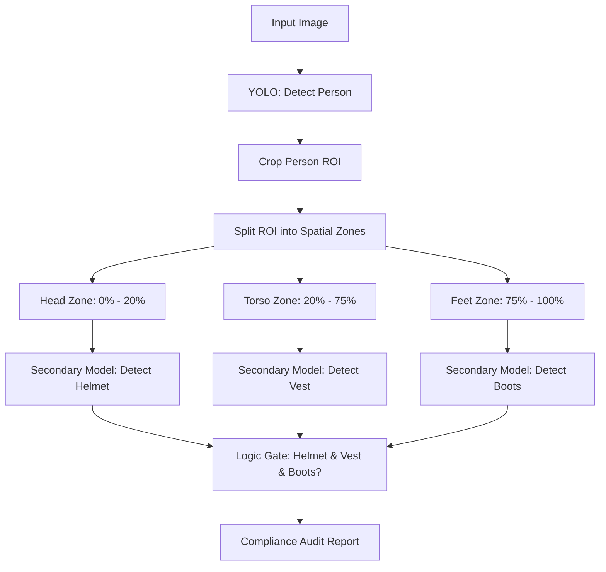

# 🧠 EX67: PPE Compliance Auditing

Personal Protective Equipment (PPE) detection is vital for industrial safety auditing (construction sites, factories, laboratories). While one could train a single YOLO detector to find helmets, vests, and safety boots in a whole image, this flat approach often fails. In this exercise, we will study **Hierarchical Computer Vision**, which uses a multi-stage pipeline: first detecting human figures, cropping them, and then executing secondary target models on specific spatial zones (head, body, feet) to verify compliance.

---

## 1. Hierarchical vs. Flat Pipelines

In a **flat pipeline**, a single model is trained to detect `person`, `hard-hat`, `safety-vest`, and `boots` simultaneously. This leads to two critical flaws:

1.  **Contextual Detachment**: A hard-hat sitting on a desk or a safety vest hanging on a wall might be detected, falsely inflating compliance statistics.
2.  **Scale Discrepancies**: Bounding boxes for people are large, whereas safety glasses, earplugs, or boots are tiny, making it hard for one multi-scale anchor network to optimize for all simultaneously.

A **hierarchical pipeline** solves this by enforcing spatial ownership:



---

## 2. Zone-Based Sub-Region Cropping

Once a `person` box is detected and cropped, we can mathematically divide the person's bounding box into relative vertical height zones. This significantly restricts the search space for secondary detectors:

*   **Head Zone ($0.0 \le y \le 0.2$)**: Restricted area to look for helmets, safety glasses, and masks.
*   **Torso Zone ($0.2 \le y \le 0.75$)**: Restricted area to look for safety vests, harnesses, and protective jackets.
*   **Feet Zone ($0.75 \le y \le 1.0$)**: Restricted area to look for steel-toed boots or safety shoes.

---

## 3. Python Code Demonstration

Here is an implementation of a hierarchical PPE auditor:

```python
import cv2
import numpy as np
from ultralytics import YOLO

# Load models
person_detector = YOLO('yolov8n.pt')          # Primary detector
ppe_detector = YOLO('yolov8n.pt')             # Secondary detector (fine-tuned on PPE classes)

def audit_ppe_compliance(image_path):
    img = cv2.imread(image_path)
    h, w, _ = img.shape
    
    # 1. Detect People (COCO class 0 is 'person')
    person_results = person_detector(img)[0]
    person_boxes = [box for box in person_results.boxes if int(box.cls[0]) == 0]
    
    audit_report = []
    
    for idx, p_box in enumerate(person_boxes):
        x1, y1, x2, y2 = p_box.xyxy[0].cpu().numpy().astype(int)
        p_w = x2 - x1
        p_h = y2 - y1
        
        # Crop the person
        person_crop = img[y1:y2, x1:x2]
        
        # 2. Extract localized ROIs by vertical height percentage
        # Head (top 25%)
        head_crop = person_crop[0:int(p_h * 0.25), 0:p_w]
        # Torso (middle 20% to 75%)
        torso_crop = person_crop[int(p_h * 0.20):int(p_h * 0.75), 0:p_w]
        # Feet (bottom 20%)
        feet_crop = person_crop[int(p_h * 0.80):p_h, 0:p_w]
        
        # 3. Detect PPE in respective zones
        # (Assuming custom fine-tuned model classes: 0=helmet, 1=vest, 2=boots)
        has_helmet = False
        has_vest = False
        has_boots = False
        
        # Query Head crop
        if head_crop.size > 0:
            head_results = ppe_detector(head_crop)[0]
            # check if class 'helmet' (e.g. class 0) is detected with high confidence
            has_helmet = any(int(b.cls[0]) == 0 and float(b.conf[0]) > 0.5 for b in head_results.boxes)
            
        # Query Torso crop
        if torso_crop.size > 0:
            torso_results = ppe_detector(torso_crop)[0]
            # check if class 'vest' (e.g. class 1) is detected
            has_vest = any(int(b.cls[0]) == 1 and float(b.conf[0]) > 0.5 for b in torso_results.boxes)
            
        # Query Feet crop
        if feet_crop.size > 0:
            feet_results = ppe_detector(feet_crop)[0]
            # check if class 'boots' (e.g. class 2) is detected
            has_boots = any(int(b.cls[0]) == 2 and float(b.conf[0]) > 0.5 for b in feet_results.boxes)
            
        # 4. Compile safety report
        compliant = has_helmet and has_vest and has_boots
        person_status = {
            "person_id": idx,
            "bbox": [x1, y1, x2, y2],
            "helmet": has_helmet,
            "vest": has_vest,
            "boots": has_boots,
            "fully_compliant": compliant
        }
        audit_report.append(person_status)
        
        # Draw visual markers on original image
        color = (0, 255, 0) if compliant else (0, 0, 255)
        cv2.rectangle(img, (x1, y1), (x2, y2), color, 2)
        label = f"ID:{idx} {'OK' if compliant else 'VIOLATION'}"
        cv2.putText(img, label, (x1, y1 - 10), cv2.FONT_HERSHEY_SIMPLEX, 0.6, color, 2)
        
    return img, audit_report
```

---

## 🛠️ Connection to Computer Vision & YOLO

*   **Computational Efficiency**: Passing a small, cropped image (e.g., $150 \times 100$ pixels) to a secondary model is computationally lightweight. The secondary models can be extremely small (like YOLO Nano or Pico variants) and run at high speed.
*   **Edge Alignment & Keypoint Alternative**: Instead of calculating static percentages (like $20\%$), you can use a **YOLO-Pose** model as the primary detector. Using the detected pose landmarks (nose, chest, ankles), you can dynamically crop the local environments of the head, torso, and feet, achieving perfect spatial alignment even when workers are bending, kneeling, or lying down.

---

*Related Topics:*
*   [[EX68_Crowd_Count_Density_Mapping]]
*   [[EX66_License_Plate_Recognition]]
*   Return to main plan: [[YOLO_Learning_Plan]]
*   Progress log: [[learning_journal]]
