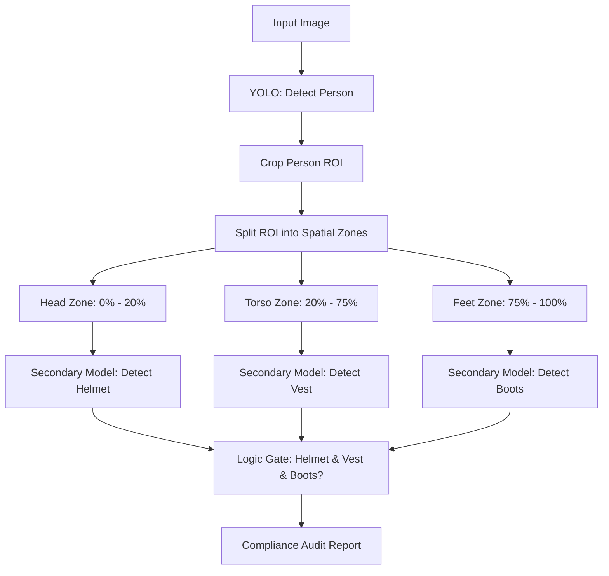

# 🧠 EX67: การตรวจสอบการสวมใส่อุปกรณ์ป้องกันความปลอดภัย (PPE Compliance Auditing)

การตรวจจับอุปกรณ์ป้องกันส่วนบุคคล (Personal Protective Equipment - PPE) มีความสำคัญอย่างยิ่งสำหรับการตรวจสอบความปลอดภัยในโรงงานอุตสาหกรรม (ไซต์ก่อสร้าง, โรงงาน, ห้องปฏิบัติการ) แม้ว่าเราจะสามารถฝึกสอนโมเดล YOLO ตัวเดียวเพื่อตรวจจับ หมวกนิรภัย (Helmet), เสื้อสะท้อนแสง (Vest) และรองเท้านิรภัย (Boots) ไปพร้อมๆ กันในภาพขนาดใหญ่ได้ แต่วิธีการแบบระนาบเดี่ยว (Flat Approach) ดังกล่าวมักจะเกิดข้อผิดพลาดได้ง่าย ในแบบฝึกหัดนี้ เราจะศึกษา **ระบบคอมพิวเตอร์วิทัศน์แบบจัดลำดับขั้น (Hierarchical Computer Vision)** ซึ่งใช้ไปป์ไลน์แบบหลายขั้นตอน: เริ่มต้นด้วยการตรวจจับบุคคล จากนั้นครอปภาพบุคคล และรันโมเดลเป้าหมายย่อยตามพิกัดพื้นที่เฉพาะเจาะจง (ศีรษะ, ลำตัว, เท้า) เพื่อตรวจสอบความถูกต้องของการสวมใส่อุปกรณ์

---

## 1. ไปป์ไลน์แบบจัดลำดับขั้น vs. แบบระนาบเดี่ยว (Hierarchical vs. Flat Pipelines)

ใน **ไปป์ไลน์แบบระนาบเดี่ยว (Flat Pipeline)** จะมีโมเดลเพียงตัวเดียวที่ทำหน้าที่ตรวจจับ `person` (บุคคล), `hard-hat` (หมวกนิรภัย), `safety-vest` (เสื้อสะท้อนแสง) และ `boots` (รองเท้านิรภัย) ไปพร้อมกัน ซึ่งก่อให้เกิดข้อเสียหลัก 2 ประการ:

1.  **การขาดความเชื่อมโยงของบริบท (Contextual Detachment)**: หมวกนิรภัยที่วางอยู่บนโต๊ะทำงานหรือเสื้อสะท้อนแสงที่แขวนอยู่บนผนังอาจถูกตรวจพบได้ ซึ่งส่งผลให้สถิติการปฏิบัติตามกฎความปลอดภัยคลาดเคลื่อน (เกิด False Positive)
2.  **ความแตกต่างของขนาดวัตถุ (Scale Discrepancies)**: กล่องขอบเขตของบุคคลมีขนาดใหญ่มากในขณะที่แว่นตานิรภัย ปลั๊กอุดหู หรือรองเท้าบู้ทมีขนาดเล็กมาก ทำให้การใช้เครือข่ายเดียวสำหรับสเกลที่แตกต่างกันมากๆ ทำงานได้ไม่มีประสิทธิภาพ

**ไปป์ไลน์แบบจัดลำดับขั้น (Hierarchical Pipeline)** สามารถแก้ปัญหานี้ได้โดยการตรวจสอบความสัมพันธ์เชิงพื้นที่ (Spatial Ownership):



---

## 2. การครอปพื้นที่ภาพย่อยตามโซนพื้นที่ (Zone-Based Sub-Region Cropping)

เมื่อตรวจจับและครอปพื้นที่กล่องขอบเขต `person` แล้ว เราสามารถแบ่งสัดส่วนกล่องขอบเขตของบุคคลตามความสูงในแนวตั้ง เพื่อจำกัดขอบเขตการค้นหาให้กับโมเดลตรวจจับย่อย:

*   **โซนศีรษะ (Head Zone: $0.0 \le y \le 0.2$)**: พื้นที่จำกัดเฉพาะสำหรับตรวจหาหมวกนิรภัย แว่นตานิรภัย และหน้ากากอนามัย
*   **โซนลำตัว (Torso Zone: $0.2 \le y \le 0.75$)**: พื้นที่จำกัดเฉพาะสำหรับตรวจหาเสื้อสะท้อนแสง เข็มขัดนิรภัย และเสื้อแจ็คเก็ตป้องกัน
*   **โซนเท้า (Feet Zone: $0.75 \le y \le 1.0$)**: พื้นที่จำกัดเฉพาะสำหรับตรวจหารองเท้าหัวเหล็กหรือรองเท้านิรภัย

---

## 3. ตัวอย่างการเขียนโค้ดด้วย Python

นี่คือตัวอย่างการนำไปใช้งานสำหรับระบบตรวจสอบความปลอดภัยทางอุตสาหกรรม:

```python
import cv2
import numpy as np
from ultralytics import YOLO

# Load models
person_detector = YOLO('yolov8n.pt')          # Primary detector
ppe_detector = YOLO('yolov8n.pt')             # Secondary detector (fine-tuned on PPE classes)

def audit_ppe_compliance(image_path):
    img = cv2.imread(image_path)
    h, w, _ = img.shape
    
    # 1. Detect People (COCO class 0 is 'person')
    person_results = person_detector(img)[0]
    person_boxes = [box for box in person_results.boxes if int(box.cls[0]) == 0]
    
    audit_report = []
    
    for idx, p_box in enumerate(person_boxes):
        x1, y1, x2, y2 = p_box.xyxy[0].cpu().numpy().astype(int)
        p_w = x2 - x1
        p_h = y2 - y1
        
        # Crop the person
        person_crop = img[y1:y2, x1:x2]
        
        # 2. Extract localized ROIs by vertical height percentage
        # Head (top 25%)
        head_crop = person_crop[0:int(p_h * 0.25), 0:p_w]
        # Torso (middle 20% to 75%)
        torso_crop = person_crop[int(p_h * 0.20):int(p_h * 0.75), 0:p_w]
        # Feet (bottom 20%)
        feet_crop = person_crop[int(p_h * 0.80):p_h, 0:p_w]
        
        # 3. Detect PPE in respective zones
        # (Assuming custom fine-tuned model classes: 0=helmet, 1=vest, 2=boots)
        has_helmet = False
        has_vest = False
        has_boots = False
        
        # Query Head crop
        if head_crop.size > 0:
            head_results = ppe_detector(head_crop)[0]
            # check if class 'helmet' (e.g. class 0) is detected with high confidence
            has_helmet = any(int(b.cls[0]) == 0 and float(b.conf[0]) > 0.5 for b in head_results.boxes)
            
        # Query Torso crop
        if torso_crop.size > 0:
            torso_results = ppe_detector(torso_crop)[0]
            # check if class 'vest' (e.g. class 1) is detected
            has_vest = any(int(b.cls[0]) == 1 and float(b.conf[0]) > 0.5 for b in torso_results.boxes)
            
        # Query Feet crop
        if feet_crop.size > 0:
            feet_results = ppe_detector(feet_crop)[0]
            # check if class 'boots' (e.g. class 2) is detected
            has_boots = any(int(b.cls[0]) == 2 and float(b.conf[0]) > 0.5 for b in feet_results.boxes)
            
        # 4. Compile safety report
        compliant = has_helmet and has_vest and has_boots
        person_status = {
            "person_id": idx,
            "bbox": [x1, y1, x2, y2],
            "helmet": has_helmet,
            "vest": has_vest,
            "boots": has_boots,
            "fully_compliant": compliant
        }
        audit_report.append(person_status)
        
        # Draw visual markers on original image
        color = (0, 255, 0) if compliant else (0, 0, 255)
        cv2.rectangle(img, (x1, y1), (x2, y2), color, 2)
        label = f"ID:{idx} {'OK' if compliant else 'VIOLATION'}"
        cv2.putText(img, label, (x1, y1 - 10), cv2.FONT_HERSHEY_SIMPLEX, 0.6, color, 2)
        
    return img, audit_report
```

---

## 🛠️ การประยุกต์ใช้ใน Computer Vision & YOLO

*   **ประสิทธิภาพการประมวลผล (Computational Efficiency)**: การส่งภาพครอปขนาดเล็ก (เช่น $150 \times 100$ พิกเซล) ไปยังโมเดลย่อยทำให้ใช้ทรัพยากรน้อยมาก โมเดลย่อยเหล่านี้สามารถเป็นเวอร์ชันที่เล็กมากๆ (เช่น YOLO Nano หรือ Pico) ซึ่งทำงานได้เร็วสูงมาก
*   **การประยุกต์ใช้ร่วมกับการตรวจจับจุดเชื่อมต่อร่างกาย (Alternative: YOLO-Pose)**: แทนที่จะแบ่งโซนเป็นเปอร์เซ็นต์แบบคงที่ (เช่น $20\%$) เราสามารถประยุกต์ใช้โมเดล **YOLO-Pose** เป็นตัวตรวจจับหลักได้ โดยใช้พิกัดจุดเชื่อมต่อข้อต่อร่างกาย (เช่น จมูก, หน้าอก, ข้อเท้า) เพื่อระบุขอบเขตโซนศีรษะ ลำตัว และเท้าแบบไดนามิก ซึ่งช่วยรองรับกรณีที่ผู้ปฏิบัติงานอยู่ในท่ายืน ก้ม คุกเข่า หรือนอนได้เป็นอย่างดี

---

*หัวข้อที่เกี่ยวข้อง:*
*   [[EX68_Crowd_Count_Density_Mapping_TH\|EX68: การนับจำนวนฝูงชนและการแผนที่ความหนาแน่น (Crowd Count & Density Mapping)]]
*   [[EX66_License_Plate_Recognition_TH\|EX66: การจดจำป้ายทะเบียนรถ (License Plate Recognition)]]
*   กลับสู่แผนการเรียนหลัก: [[YOLO_Learning_Plan\|แผนการเรียน YOLO]]
*   บันทึกความก้าวหน้า: [[learning_journal\|บันทึกการเรียนรู้]]
