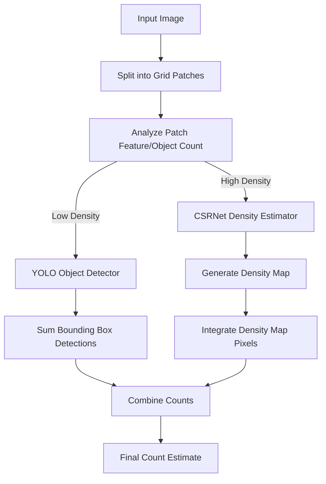

# 🧠 EX68: Crowd Count and Density Mapping

Counting people in public spaces, stadiums, or protest rallies is vital for urban planning and security. Standard object detection models like YOLO perform exceptionally well in sparse environments but fail in extremely dense crowds due to severe overlapping, occlusions, and minuscule target sizes. In this exercise, we will study a **hybrid crowd estimation pipeline** that uses YOLO to count people in sparse regions, while routing dense crowd clusters to a Density Estimation network (such as CSRNet) to estimate crowd size.

---

## 1. The Occlusion Dilemma in Crowd Counting

When crowd density increases, standard bounding box detection breaks down:
*   **Occlusion**: Only a small fraction of a person's head/shoulder is visible.
*   **Bounding Box NMS Overlap**: Non-Maximum Suppression (NMS) often merges adjacent people because their boxes overlap significantly.
*   **Scale Variation**: Perspective effect makes foreground people look huge and background people look like single pixels.

To solve this, we implement a **hybrid pipeline**:
1.  **Grid-based Density Analysis**: Divide the image into a grid of patches.
2.  **YOLO Path (Sparse Patches)**: If a patch contains few objects, YOLO detects and counts them individually.
3.  **Density Estimation Path (Dense Patches)**: If a patch exceeds a density threshold, it is routed to a regression CNN (e.g., **CSRNet**) that predicts a continuous density map instead of individual boxes.



---

## 2. Density Estimation Mathematics

Instead of predicting bounding boxes, a density estimation network outputs a single-channel heatmap $D(x, y)$, where the value at each pixel represents the fractional density of a person. 

### Ground Truth Generation
To train a density estimator, head centers in the training images are annotated as delta functions $\delta(x - x_i)$. This discrete map is smoothed using a Gaussian kernel $G_{\sigma}$:

$$D(x) = \sum_{i=1}^{N} \delta(x - x_i) * G_{\sigma}(x)$$

Where $\sigma$ represents the head size. In dense scenes, $\sigma$ is dynamically determined based on the distance to the $k$-nearest neighbors (geometry-adaptive kernels).

### Integrating the Map
The total estimated crowd count $N$ is simply the integration (sum) of all pixel values across the entire predicted density map:

$$N = \sum_{x} \sum_{y} D(x, y)$$

---

## 3. Python Code Demonstration

Here is a hybrid controller pipeline that combines YOLOv8 detection with a simulated density estimator for dense patches:

```python
import cv2
import numpy as np
from ultralytics import YOLO

# Load YOLOv8 Model (pre-trained on COCO to detect persons)
detector = YOLO('yolov8n.pt')

def estimate_patch_density_csrnet(img_patch):
    """
    Simulates a CSRNet (Congested Scene Recognition Network) forward pass.
    In practice, you would load a trained PyTorch CSRNet model:
    density_map = csrnet(img_patch)
    count = density_map.sum().item()
    """
    # Dummy CSRNet implementation: Estimating density via texture/edge analysis
    gray = cv2.cvtColor(img_patch, cv2.COLOR_BGR2GRAY)
    edges = cv2.Canny(gray, 50, 150)
    edge_density = np.sum(edges > 0) / edges.size
    
    # Scale edge density to a mock person count (higher edge density = more people)
    mock_count = float(edge_density * 45.0) 
    return mock_count

def hybrid_crowd_count(image_path, grid_rows=2, grid_cols=2, density_threshold=8):
    img = cv2.imread(image_path)
    h, w, _ = img.shape
    
    patch_h = h // grid_rows
    patch_w = w // grid_cols
    
    total_crowd = 0.0
    
    for r in range(grid_rows):
        for c in range(grid_cols):
            # Define grid coordinates
            y1, y2 = r * patch_h, (r + 1) * patch_h
            x1, x2 = c * patch_w, (c + 1) * patch_w
            patch = img[y1:y2, x1:x2]
            
            # 1. Run YOLO on the patch to see if it is sparse
            yolo_results = detector(patch, verbose=False)[0]
            # Class 0 is 'person' in COCO dataset
            people_boxes = [box for box in yolo_results.boxes if int(box.cls[0]) == 0]
            yolo_count = len(people_boxes)
            
            # 2. Routing Decision
            if yolo_count < density_threshold:
                # Sparse patch: Use precise YOLO detections
                total_crowd += yolo_count
                print(f"Patch ({r},{c}): Sparse. Routed to YOLO. Count = {yolo_count}")
            else:
                # Dense patch: YOLO is highly likely to miss occluded people. Route to CSRNet.
                dense_count = estimate_patch_density_csrnet(patch)
                total_crowd += dense_count
                print(f"Patch ({r},{c}): Congested! Routed to CSRNet. Estimated Count = {dense_count:.1f}")
                
    print(f"Total Combined Crowd Count: {round(total_crowd)}")
    return round(total_crowd)
```

---

## 💡 Professor Tips

1.  **Evaluation Metrics**: Unlike object detection which uses mean Average Precision (mAP), density estimation networks are evaluated using:
    *   **Mean Absolute Error (MAE)**: Measures accuracy of count.
        $$\text{MAE} = \frac{1}{M}\sum_{i=1}^{M} |N_i - N_i^{\text{gt}}|$$
    *   **Mean Squared Error (MSE)**: Measures robustness and sensitivity to outliers.
        $$\text{MSE} = \sqrt{\frac{1}{M}\sum_{i=1}^{M} (N_i - N_i^{\text{gt}})^2}$$
2.  **Geometry-Adaptive Kernels**: In highly crowded perspective scenes, people far away appear smaller than people close to the camera. When building training targets, calculate the distance from each annotated head $x_i$ to its 3 nearest neighbors ($d_i$). Set the Gaussian standard deviation $\sigma_i = \beta \bar{d}_i$ (with $\beta \approx 0.3$) to dynamically adjust target kernel size.

---

*Related Topics:*
*   [[EX69_Defect_Detection_SAHI]]
*   [[EX67_PPE_Compliance_Auditing]]
*   Return to main plan: [[YOLO_Learning_Plan]]
*   Progress log: [[learning_journal]]
