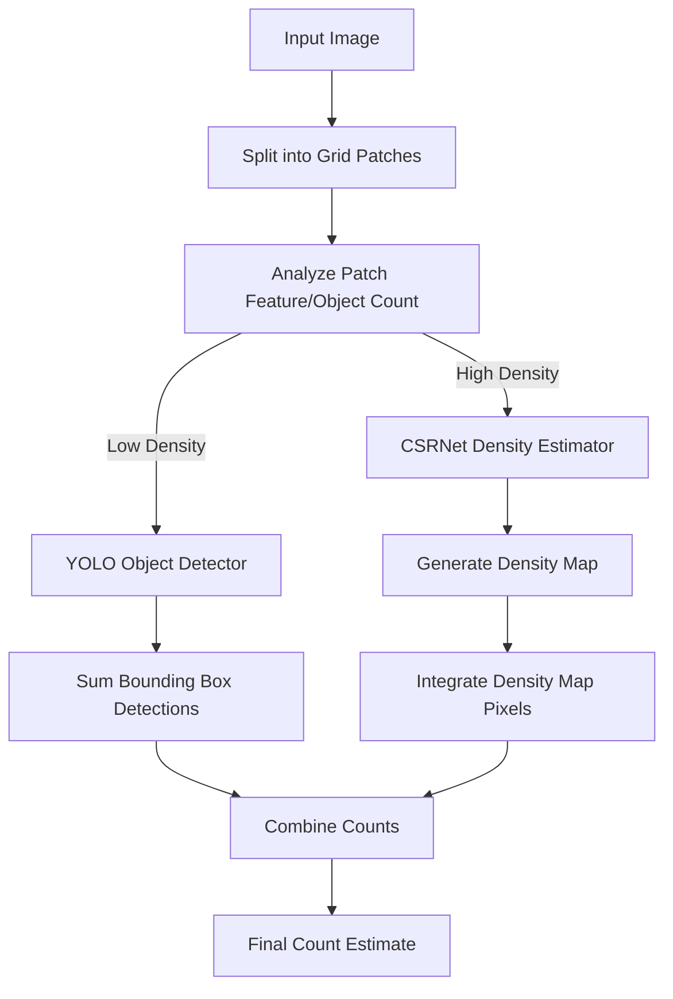

# 🧠 EX68: การนับจำนวนฝูงชนและการแผนที่ความหนาแน่น (Crowd Count & Density Mapping)

การนับจำนวนคนในพื้นที่สาธารณะ สนามกีฬา หรือการชุมนุมประท้วง มีความสำคัญอย่างยิ่งต่อการวางผังเมืองและความปลอดภัย โมเดลตรวจจับวัตถุมาตรฐานอย่าง YOLO ทำงานได้ดีเป็นพิเศษในสภาพแวดล้อมที่ผู้คนเบาบาง แต่จะล้มเหลวในพื้นที่ที่มีฝูงชนหนาแน่นอย่างหนาตาเนื่องจากปัญหาการบดบังซ้อนทับกันอย่างรุนแรง และขนาดของเป้าหมายที่เล็กมาก ในแบบฝึกหัดนี้ เราจะศึกษา **ไปป์ไลน์ประมาณจำนวนฝูงชนแบบผสมผสาน (Hybrid Crowd Estimation Pipeline)** ซึ่งจะใช้ YOLO สำหรับนับจำนวนในบริเวณที่เบาบาง และส่งต่อบริเวณที่ฝูงชนหนาแน่นไปยังเครือข่ายประมาณค่าความหนาแน่น (เช่น CSRNet) เพื่อคาดการณ์จำนวนฝูงชน

---

## 1. ปัญหาการบดบังซ้อนทับในการนับจำนวนฝูงชน (The Occlusion Dilemma)

เมื่อความหนาแน่นของฝูงชนเพิ่มขึ้น การตรวจจับด้วยกล่องขอบเขตมาตรฐานจะเริ่มใช้การไม่ได้เนื่องจาก:
*   **การบดบัง (Occlusion)**: มีเพียงเศษเสี้ยวเล็กๆ ของศีรษะหรือหัวไหล่ของบุคคลเท่านั้นที่มองเห็นในภาพ
*   **การทับซ้อนในขั้นตอน NMS**: ขั้นตอน Non-Maximum Suppression (NMS) มักจะเผลอยุบรวมกล่องขอบเขตของคนที่อยู่ติดกันเนื่องจากกล่องซ้อนทับกันมากเกินไป
*   **ความแตกต่างของขนาดระยะลึก (Scale Variation)**: ผลกระทบจากมุมมองเปอร์สเปกทีฟทำให้คนที่อยู่ใกล้กล้องมีขนาดใหญ่มาก ในขณะที่คนที่อยู่ห่างออกไปทางด้านหลังมีขนาดเล็กเพียงไม่กี่พิกเซล

เพื่อแก้ปัญหานี้ เราจึงเลือกใช้ **ไปป์ไลน์แบบผสมผสาน (Hybrid Pipeline)**:
1.  **การวิเคราะห์ความหนาแน่นระดับกริด (Grid-based Density Analysis)**: แบ่งรูปภาพออกเป็นตารางกริดย่อยๆ (Patches)
2.  **เส้นทาง YOLO (บริเวณเบาบาง)**: หากกริดย่อยมีวัตถุอยู่น้อย โมเดล YOLO จะตรวจจับและนับจำนวนคนทีละคนด้วยกล่องขอบเขต
3.  **เส้นทางประมาณค่าความหนาแน่น (บริเวณหนาแน่น)**: หากกริดย่อยมีความหนาแน่นเกินเกณฑ์ที่กำหนด จะถูกส่งต่อไปยังเครือข่ายประสาทเทียมแบบถดถอย (Regression CNN เช่น **CSRNet**) เพื่อทำนาย **แผนที่ความหนาแน่นแบบต่อเนื่อง (Continuous Density Map)** แทนการหาขอบเขตทีละกล่อง



---

## 2. คณิตศาสตร์ของการประมาณค่าความหนาแน่น (Density Estimation Mathematics)

แทนที่จะทำนายกล่องขอบเขต เครือข่ายประมาณค่าความหนาแน่นจะส่งออกภาพความร้อนช่องสัญญาณเดี่ยว (Single-channel Heatmap) $D(x, y)$ โดยที่ค่าในแต่ละพิกเซลจะแสดงถึงความหนาแน่นเศษส่วนของบุคคล ณ จุดพิกัดนั้น

### การสร้างข้อมูลเฉลยคำตอบ (Ground Truth Generation)
ในการฝึกสอนตัวประมาณค่าความหนาแน่น จุดศูนย์กลางของศีรษะคนในภาพชุดฝึกสอนจะถูกทำเครื่องหมายเป็นฟังก์ชันเดลต้า $\delta(x - x_i)$ จากนั้นแผนที่แบบไม่ต่อเนื่องนี้จะถูกเกลี่ยให้เรียบเนียนด้วยเคอร์เนลแบบเกาส์เซียน (Gaussian Kernel) $G_{\sigma}$:

$$D(x) = \sum_{i=1}^{N} \delta(x - x_i) * G_{\sigma}(x)$$

โดยที่ $\sigma$ แทนขนาดของศีรษะ ในกรณีของภาพที่หนาแน่นมาก ค่า $\sigma$ จะถูกคำนวณแบบไดนามิกตามระยะห่างไปยังเพื่อนบ้านที่ใกล้ที่สุด $k$ ลำดับแรก (Geometry-adaptive Kernels)

### การหาผลรวมพิกเซลความหนาแน่น (Integrating the Map)
จำนวนฝูงชนที่ประมาณได้ทั้งหมด $N$ คือผลรวมพิกเซลทั้งหมดของแผนที่ความหนาแน่นที่ทำนายออกมา:

$$N = \sum_{x} \sum_{y} D(x, y)$$

---

## 3. ตัวอย่างการเขียนโค้ดด้วย Python

นี่คือตัวอย่างการเขียนระบบควบคุมแบบผสมผสานที่ผสานการตรวจจับ YOLOv8 เข้ากับการจำลองตัวประมาณค่าความหนาแน่นสำหรับโซนหนาแน่น:

```python
import cv2
import numpy as np
from ultralytics import YOLO

# Load YOLOv8 Model (pre-trained on COCO to detect persons)
detector = YOLO('yolov8n.pt')

def estimate_patch_density_csrnet(img_patch):
    """
    Simulates a CSRNet (Congested Scene Recognition Network) forward pass.
    In practice, you would load a trained PyTorch CSRNet model:
    density_map = csrnet(img_patch)
    count = density_map.sum().item()
    """
    # Dummy CSRNet implementation: Estimating density via texture/edge analysis
    gray = cv2.cvtColor(img_patch, cv2.COLOR_BGR2GRAY)
    edges = cv2.Canny(gray, 50, 150)
    edge_density = np.sum(edges > 0) / edges.size
    
    # Scale edge density to a mock person count (higher edge density = more people)
    mock_count = float(edge_density * 45.0) 
    return mock_count

def hybrid_crowd_count(image_path, grid_rows=2, grid_cols=2, density_threshold=8):
    img = cv2.imread(image_path)
    h, w, _ = img.shape
    
    patch_h = h // grid_rows
    patch_w = w // grid_cols
    
    total_crowd = 0.0
    
    for r in range(grid_rows):
        for c in range(grid_cols):
            # Define grid coordinates
            y1, y2 = r * patch_h, (r + 1) * patch_h
            x1, x2 = c * patch_w, (c + 1) * patch_w
            patch = img[y1:y2, x1:x2]
            
            # 1. Run YOLO on the patch to see if it is sparse
            yolo_results = detector(patch, verbose=False)[0]
            # Class 0 is 'person' in COCO dataset
            people_boxes = [box for box in yolo_results.boxes if int(box.cls[0]) == 0]
            yolo_count = len(people_boxes)
            
            # 2. Routing Decision
            if yolo_count < density_threshold:
                # Sparse patch: Use precise YOLO detections
                total_crowd += yolo_count
                print(f"Patch ({r},{c}): Sparse. Routed to YOLO. Count = {yolo_count}")
            else:
                # Dense patch: YOLO is highly likely to miss occluded people. Route to CSRNet.
                dense_count = estimate_patch_density_csrnet(patch)
                total_crowd += dense_count
                print(f"Patch ({r},{c}): Congested! Routed to CSRNet. Estimated Count = {dense_count:.1f}")
                
    print(f"Total Combined Crowd Count: {round(total_crowd)}")
    return round(total_crowd)
```

---

## 💡 คำแนะนำจากอาจารย์ (Professor Tips)

1.  **ตัวชี้วัดประสิทธิภาพ (Evaluation Metrics)**: ต่างจากการตรวจจับวัตถุทั่วไปที่ใช้ค่า mean Average Precision (mAP) ในงานการประมาณค่าความหนาแน่นจะประเมินผลผ่านตัวชี้วัดเหล่านี้:
    *   **Mean Absolute Error (MAE)**: วัดความถูกต้องของจำนวนคนที่นับได้
        $$\text{MAE} = \frac{1}{M}\sum_{i=1}^{M} |N_i - N_i^{\text{gt}}|$$
    *   **Mean Squared Error (MSE)**: วัดความทนทานและความไวต่อค่าที่เบี่ยงเบนผิดปกติ (Outliers)
        $$\text{MSE} = \sqrt{\frac{1}{M}\sum_{i=1}^{M} (N_i - N_i^{\text{gt}})^2}$$
2.  **เคอร์เนลปรับขนาดตามรูปทรง (Geometry-Adaptive Kernels)**: ในภาพถ่ายฝูงชนที่มีมุมมองเปอร์สเปกทีฟลึก ชิ้นส่วนศีรษะของคนที่อยู่ด้านหลังจะดูเล็กกว่าด้านหน้ามาก ในการเตรียมชุดข้อมูลเฉลย เราจะคำนวณระยะห่างระหว่างจุดหัวคน $x_i$ ไปยังเพื่อนบ้านที่ใกล้ที่สุด 3 ลำดับแรก ($\bar{d}_i$) และกำหนดค่าเบี่ยงเบนมาตรฐานเกาส์เซียน $\sigma_i = \beta \bar{d}_i$ (โดยที่ $\beta \approx 0.3$) เพื่อสร้างเป้าหมายแผนที่ความหนาแน่นที่สอดคล้องกับขนาดศีรษะในทุกระนาบระยะลึก

---

*หัวข้อที่เกี่ยวข้อง:*
*   [[EX69_Defect_Detection_SAHI_TH\|EX69: การตรวจจับข้อบกพร่องด้วย SAHI (Defect Detection with SAHI)]]
*   [[EX67_PPE_Compliance_Auditing_TH\|EX67: การตรวจสอบการสวมใส่อุปกรณ์ป้องกันความปลอดภัย (PPE Compliance Auditing)]]
*   กลับสู่แผนการเรียนหลัก: [[YOLO_Learning_Plan\|แผนการเรียน YOLO]]
*   บันทึกความก้าวหน้า: [[learning_journal\|บันทึกการเรียนรู้]]
