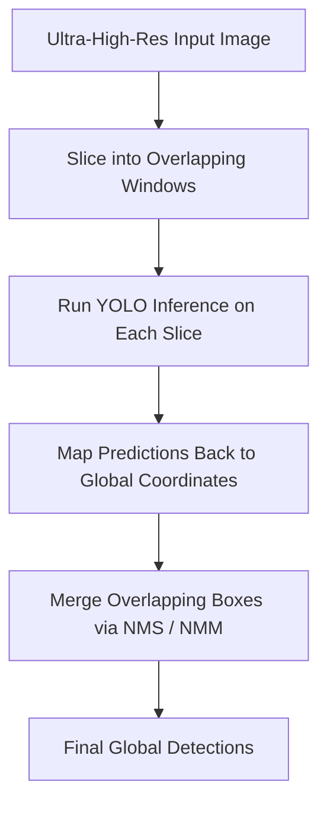

# 🧠 EX69: Defect Detection with SAHI

Industrial inspection (steel sheets, textile rolls, solar panels) often employs ultra-high-resolution cameras (e.g., 4K or 8K) to scan for tiny surface defects like cracks, scratches, or pinholes. If you downsample these huge images to YOLO's default input resolution (e.g., $640 \times 640$), tiny defects become smaller than a single pixel and disappear completely. In this exercise, we will study **Sliced Aided Hyper Inference (SAHI)**, a powerful framework that runs YOLO in window-sliced patches and merges predictions.

---

## 1. The Small Object Detection Problem in High-Res Imagery

When dealing with large-format industrial imagery:
*   **Feature Loss**: Downscaling a $4096 \times 4096$ pixel image to $640 \times 640$ represents a $97.5\%$ reduction in pixel area. A $10 \times 10$ pixel defect is compressed to less than $0.2 \times 0.2$ pixels, making it mathematically impossible to detect.
*   **Aspect Ratio Distortion**: Non-square industrial webs get warped when forced into square input frames, distorting defect shapes.

**Sliced Aided Hyper Inference (SAHI)** addresses this by retaining the raw pixel resolution:



---

## 2. SAHI Workflow Step-by-Step

### A. Slicing (Tiling)
The source image is divided into grids of dimensions $W_s \times H_s$ (e.g., $640 \times 640$). To prevent missing defects that lie directly on patch borders, an overlap ratio $O_r$ (e.g., $20\%$) is applied.

### B. Patch Inference
Each slice is sent to the standard YOLO model independently. Since the slice size matches YOLO's native training resolution, no feature loss occurs.

### C. Coordinate Translation
Bounding boxes detected in slice space $(x_{\text{local}}, y_{\text{local}})$ are translated back to the global image coordinate system by adding the slice offsets:

$$x_{\text{global}} = x_{\text{local}} + x_{\text{slice\_start}}$$
$$y_{\text{global}} = y_{\text{local}} + y_{\text{slice\_start}}$$

### D. Prediction Merging
Because slices overlap, single objects at slice edges may be detected multiple times. SAHI performs global **Non-Maximum Suppression (NMS)** or **Non-Maximum Merging (NMM)** to consolidate duplicates into single detections.

---

## 3. Python Code Demonstration

Here is an implementation of sliced inference using the `sahi` library and `ultralytics` YOLO:

```python
# Note: Requires installing sahi: pip install sahi
import cv2
from sahi import AutoDetectionModel
from sahi.predict import get_sliced_prediction

# 1. Initialize the YOLO model wrapper in SAHI
# We use a custom fine-tuned model for defects (simulated here with yolov8n.pt)
detection_model = AutoDetectionModel.from_class(
    model_type="ultralytics",
    model_path="yolov8n.pt",
    device="cpu",  # or 'cuda:0'
    confidence_threshold=0.4
)

def run_sliced_defect_detection(image_path, output_path="inspected_web.jpg"):
    # Read original high-resolution image to inspect
    img = cv2.imread(image_path)
    print(f"Original Image Size: {img.shape[1]}x{img.shape[0]}")
    
    # 2. Execute Sliced Inference
    result = get_sliced_prediction(
        image_path,
        detection_model,
        slice_height=640,
        slice_width=640,
        overlap_height_ratio=0.2,
        overlap_width_ratio=0.2,
        perform_standard_inference=False  # Avoid running inference on full image (saves time)
    )
    
    # 3. Parse and Draw Predictions
    # The result contains coordinates mapped back to the global space
    object_prediction_list = result.object_prediction_list
    print(f"Detected {len(object_prediction_list)} defects using SAHI slicing.")
    
    for pred in object_prediction_list:
        # Get bounding box in global coordinates
        bbox = pred.bbox.to_xyxy()  # [xmin, ymin, xmax, ymax]
        x1, y1, x2, y2 = map(int, bbox)
        
        label = pred.category.name
        score = pred.score.value
        
        # Draw on original image
        cv2.rectangle(img, (x1, y1), (x2, y2), (0, 0, 255), 3)
        cv2.putText(
            img, 
            f"{label}: {score:.2f}", 
            (x1, y1 - 10), 
            cv2.FONT_HERSHEY_SIMPLEX, 
            0.8, 
            (0, 0, 255), 
            2
        )
        
    cv2.imwrite(output_path, img)
    print(f"Inspection visualization saved to {output_path}")

# Example execution
# run_sliced_defect_detection("steel_sheet_8k.jpg")
```

---

## 💡 Professor Tips

*   **Computational Trade-off**: SAHI improves model recall for tiny objects dramatically, but it increases processing time. An $8000 \times 8000$ image processed in $640 \times 640$ patches with $20\%$ overlap results in roughly $250$ slice inference forwards. To optimize:
    1.  Use a smaller batch size for patches.
    2.  Filter out empty slices if you have a lightweight pre-segmentation mask (e.g., ignoring plain background).
*   **Standard + Sliced Inference**: SAHI allows running both sliced and full-image standard inference together. This is helpful if your dataset contains both massive objects (which get cut into pieces by sliced windows) and tiny objects. SAHI merges the predictions of both methods smoothly.

---

*Related Topics:*
*   [[EX68_Crowd_Count_Density_Mapping]]
*   Return to main plan: [[YOLO_Learning_Plan]]
*   Progress log: [[learning_journal]]
