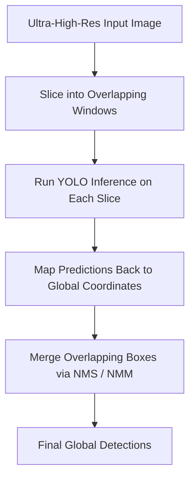

# 🧠 EX69: การตรวจจับข้อบกพร่องด้วย SAHI (Defect Detection with SAHI)

การตรวจสอบทางอุตสาหกรรม (แผ่นเหล็ก, ม้วนสิ่งทอ, แผงโซลาร์เซลล์) มักจะใช้กล้องความละเอียดสูงพิเศษ (เช่น 4K หรือ 8K) เพื่อสแกนหาข้อบกพร่องเล็กๆ บนพื้นผิว เช่น รอยร้าว รอยขีดข่วน หรือรูเข็มขนาดเล็ก หากคุณย่อภาพขนาดใหญ่เหล่านี้ลงเหลือความละเอียดอินพุตเริ่มต้นของ YOLO (เช่น $640 \times 640$) ข้อบกพร่องเล็กๆ เหล่านั้นจะมีขนาดเล็กกว่าหนึ่งพิกเซลและหายไปอย่างสิ้นเชิง ในแบบฝึกหัดนี้ เราจะศึกษาโครงสร้างการทำงานของ **Sliced Aided Hyper Inference (SAHI)** ซึ่งเป็นเฟรมเวิร์กที่มีประสิทธิภาพในการรัน YOLO บนหน้าต่างย่อย (Slices) และรวมผลการทำนายเข้าด้วยกัน

---

## 1. ปัญหาการตรวจจับวัตถุขนาดเล็กในภาพความละเอียดสูง (Small Object Detection Problem)

เมื่อประมวลผลรูปภาพอุตสาหกรรมขนาดใหญ่:
*   **การสูญเสียคุณลักษณะ (Feature Loss)**: การลดขนาดรูปภาพขนาด $4096 \times 4096$ พิกเซลลงเหลือ $640 \times 640$ พิกเซล คิดเป็นการสูญเสียพื้นที่พิกเซลถึง $97.5\%$ ทำให้ข้อบกพร่องขนาด $10 \times 10$ พิกเซลถูกบีบอัดจนเหลือไม่ถึง $0.2 \times 0.2$ พิกเซล ซึ่งทำให้โมเดลไม่สามารถตรวจจับได้ทางคณิตศาสตร์
*   **การบิดเบี้ยวของอัตราส่วนภาพ (Aspect Ratio Distortion)**: ม้วนสิ่งทอหรือแผ่นเหล็กอุตสาหกรรมที่ไม่เป็นรูปสี่เหลี่ยมจัตุรัสจะบิดเบี้ยวเมื่อถูกบังคับให้อยู่ในกรอบสเกลสี่เหลี่ยมจัตุรัส ส่งผลให้รูปร่างของข้อบกพร่องผิดเพี้ยนไป

**Sliced Aided Hyper Inference (SAHI)** แก้ปัญหานี้โดยการรักษาความละเอียดพิกเซลดั้งเดิมไว้:



---

## 2. ขั้นตอนการทำงานของ SAHI ทีละขั้นตอน

### A. การแบ่งชิ้นส่วนภาพ (Slicing / Tiling)
รูปภาพต้นฉบับจะถูกแบ่งออกเป็นตารางย่อยๆ ที่มีขนาด $W_s \times H_s$ (เช่น $640 \times 640$) เพื่อไม่ให้พลาดข้อบกพร่องที่อยู่คร่อมเส้นขอบชิ้นส่วน เราจึงต้องกำหนดอัตราส่วนการทับซ้อน $O_r$ (เช่น $20\%$) เสมอ

### B. การทำนายผลบนชิ้นส่วนย่อย (Patch Inference)
ชิ้นส่วนย่อยแต่ละชิ้นจะถูกส่งไปยังโมเดล YOLO มาตรฐานแยกกัน เนื่องจากขนาดของชิ้นส่วนย่อยตรงกับขนาดความละเอียดดั้งเดิมที่ใช้ฝึกสอนโมเดล จึงไม่มีการสูญเสียคุณลักษณะระดับพิกเซลเกิดขึ้น

### C. การแปลงพิกัด (Coordinate Translation)
กล่องขอบเขตที่ตรวจพบในระบบพิกัดชิ้นส่วนย่อย $(x_{\text{local}}, y_{\text{local}})$ จะถูกแปลงกลับไปเป็นระบบพิกัดรูปภาพขนาดใหญ่ต้นฉบับโดยบวกค่าออฟเซ็ตการแบ่งชิ้นส่วน:

$$x_{\text{global}} = x_{\text{local}} + x_{\text{slice\_start}}$$
$$y_{\text{global}} = y_{\text{local}} + y_{\text{slice\_start}}$$

### D. การผสานผลการทำนาย (Prediction Merging)
เนื่องจากชิ้นส่วนย่อยมีการทับซ้อนกัน วัตถุชิ้นเดียวกันที่อยู่ขอบภาพอาจถูกตรวจพบซ้ำหลายครั้ง SAHI จะทำหน้าที่รันกระบวนการ **Non-Maximum Suppression (NMS)** หรือ **Non-Maximum Merging (NMM)** ทั่วทั้งภาพใหญ่ เพื่อรวมกล่องที่ซ้ำกันให้เหลือการตรวจจับเดียว

---

## 3. ตัวอย่างการเขียนโค้ดด้วย Python

นี่คือตัวอย่างการนำการประเมินผลแบบแบ่งชิ้นภาพมาใช้งานจริงด้วยไลบรารี `sahi` ร่วมกับ `ultralytics` YOLO:

```python
# Note: Requires installing sahi: pip install sahi
import cv2
from sahi import AutoDetectionModel
from sahi.predict import get_sliced_prediction

# 1. Initialize the YOLO model wrapper in SAHI
# We use a custom fine-tuned model for defects (simulated here with yolov8n.pt)
detection_model = AutoDetectionModel.from_class(
    model_type="ultralytics",
    model_path="yolov8n.pt",
    device="cpu",  # or 'cuda:0'
    confidence_threshold=0.4
)

def run_sliced_defect_detection(image_path, output_path="inspected_web.jpg"):
    # Read original high-resolution image to inspect
    img = cv2.imread(image_path)
    print(f"Original Image Size: {img.shape[1]}x{img.shape[0]}")
    
    # 2. Execute Sliced Inference
    result = get_sliced_prediction(
        image_path,
        detection_model,
        slice_height=640,
        slice_width=640,
        overlap_height_ratio=0.2,
        overlap_width_ratio=0.2,
        perform_standard_inference=False  # Avoid running inference on full image (saves time)
    )
    
    # 3. Parse and Draw Predictions
    # The result contains coordinates mapped back to the global space
    object_prediction_list = result.object_prediction_list
    print(f"Detected {len(object_prediction_list)} defects using SAHI slicing.")
    
    for pred in object_prediction_list:
        # Get bounding box in global coordinates
        bbox = pred.bbox.to_xyxy()  # [xmin, ymin, xmax, ymax]
        x1, y1, x2, y2 = map(int, bbox)
        
        label = pred.category.name
        score = pred.score.value
        
        # Draw on original image
        cv2.rectangle(img, (x1, y1), (x2, y2), (0, 0, 255), 3)
        cv2.putText(
            img, 
            f"{label}: {score:.2f}", 
            (x1, y1 - 10), 
            cv2.FONT_HERSHEY_SIMPLEX, 
            0.8, 
            (0, 0, 255), 
            2
        )
        
    cv2.imwrite(output_path, img)
    print(f"Inspection visualization saved to {output_path}")

# Example execution
# run_sliced_defect_detection("steel_sheet_8k.jpg")
```

---

## 💡 คำแนะนำจากอาจารย์ (Professor Tips)

*   **ความสมดุลด้านทรัพยากรการคำนวณ (Computational Trade-off)**: SAHI ปรับปรุงความแม่นยำในการจดจำวัตถุขนาดเล็กได้เป็นอย่างดี แต่เพิ่มเวลาในการประมวลผลอย่างมาก รูปภาพขนาด $8000 \times 8000$ พิกเซลเมื่อประมวลผลด้วยขนาดชิ้นส่วน $640 \times 640$ พิกเซลทับซ้อน $20\%$ จะทำให้เกิดการประมวลผลโมเดลย่อยประมาณ $250$ ครั้ง เพื่อปรับแต่งประสิทธิภาพ:
    1.  ใช้ขนาดแบทช์ (Batch Size) ขนาดเล็กสำหรับชิ้นส่วนย่อย
    2.  ละทิ้งชิ้นส่วนที่เป็นพื้นว่างเปล่าหากสามารถทำการคัดกรองเบื้องต้นได้ก่อน (เช่น ส่วนที่เป็นสีพื้นหลังปกติ)
*   **การทำนายแบบมาตรฐานร่วมกับการทำนายแบบแบ่งชิ้นส่วน (Standard + Sliced Inference)**: SAHI อนุญาตให้ประมวลผลทั้งแบบแบ่งชิ้นส่วนควบคู่ไปกับการรันภาพเต็มขนาดมาตรฐาน ซึ่งมีประโยชน์มากหากข้อมูลของคุณมีทั้งวัตถุขนาดใหญ่มาก (ซึ่งอาจถูกตัดแบ่งเป็นชิ้นย่อยๆ) และวัตถุขนาดเล็กมาก SAHI จะผสานผลการตรวจจับจากทั้งสองส่วนให้อย่างแนบเนียน

---

*หัวข้อที่เกี่ยวข้อง:*
*   [[EX68_Crowd_Count_Density_Mapping_TH\|EX68: การนับจำนวนฝูงชนและการแผนที่ความหนาแน่น (Crowd Count & Density Mapping)]]
*   กลับสู่แผนการเรียนหลัก: [[YOLO_Learning_Plan\|แผนการเรียน YOLO]]
*   บันทึกความก้าวหน้า: [[learning_journal\|บันทึกการเรียนรู้]]
